# EnglishAI · 智能英语学习平台 — PRD & 页面信息架构

| 项目信息 | 内容 |
| --- | --- |
| Language | 简体中文（技术名词保留英文） |
| Project Name | `englishai` |
| Programming Language | Vite + React 18 + TypeScript + MUI + Tailwind CSS（默认技术栈） |
| 文档版本 | v1.0 |
| 作者 | 许清楚 · Product Manager |
| 下游交付对象 | 高见远 · Architect（技术架构设计） |

## 原始需求复述

构建一个面向大学生、英语学习者、CET-4/CET-6 备考用户的**综合型 AI 英语学习平台**。它不是背单词工具，而是覆盖「词汇 + 听力 + 口语 + 阅读 + 写作 + 语法 + 翻译 + AI 陪练 + CET4/6 + 个性化学习计划 + 数据分析」的完整学习闭环。核心目标：**用户每天打开软件 3 秒内知道"今天应该学什么"，AI 持续分析水平/错误/习惯并自动制定与调整学习计划。**

功能范围共 **45 项**（见 §1.4 清单），全部需在本信息架构中找到归属页面/模块。

---

## 一、产品目标与用户

### 1.1 Product Goals（3 个正交目标）

| # | 目标 | 说明 |
| --- | --- | --- |
| G1 | **降低决策成本** | 用户打开 App 后 3 秒内获得"今天学什么"的明确答案（Dashboard 今日任务 + AI 建议），无需自行规划 |
| G2 | **构建完整学习闭环** | 学（输入）→ 练（听力/口语/阅读/写作）→ 测（CET/模拟考）→ 评（AI 批改/评分）→ 纠（错题本/复习）→ 调（AI 计划）形成闭环，数据互通 |
| G3 | **AI 个性化驱动** | AI 基于水平测试、错题、掌握度、学习习惯持续生成并动态调整学习计划，实现"千人千面" |

### 1.2 成功指标（量化，5 条）

| ID | 指标 | 目标值 | 测量口径 |
| --- | --- | --- | --- |
| M1 | 次日留存率（D1 Retention） | ≥ 45% | 注册后次日回访占比 |
| M2 | 日均学习时长 / 活跃用户 | ≥ 22 min/DAU | Analytics `study_time` 聚合 |
| M3 | 学习计划完成率 | ≥ 60% | 日任务完成数 / 日任务总数 |
| M4 | AI 功能渗透率 | ≥ 70% 的 DAU 至少触发 1 次 AI 能力 | AI 调用日志去重用户数 |
| M5 | 首屏决策时间 | ≤ 3 s（T90） | 首屏渲染完成 → 用户首次点击"开始学习" |

### 1.3 目标用户与核心场景（3 个 Persona）

| Persona | 描述 | 核心痛点 | 主路径 |
| --- | --- | --- | --- |
| **P1 · 大学生备考党**（主力，~60%） | 大二/大三，目标 CET-4/CET-6，自律性一般，手机为主 | 不知道从哪开始、坚持不下来、不知道自己哪里弱 | Landing → 注册 → Onboarding(8 步) → Placement Test → AI 学习计划 → CET-4/6 专区（词汇/真题/模拟考）→ 错题本 → Analytics |
| **P2 · 英语能力提升者**（~25%） | 在职/考研/出国预备，PC + 移动双端，追求口语与写作 | 缺练习对象、写作没人改、口语不敢开口 | Landing → Onboarding → Placement Test → AI Tutor Chat / AI Speaking Partner → Writing Lab → Analytics |
| **P3 · 兴趣/轻学习者**（~15%） | 日常碎片化学习，通勤/睡前场景，手机为主 | 时间碎片、难以坚持 | Landing → 快速开始 → 每日挑战 / 睡前复习模式 → 单词 + 短听力 → Streak + 成就 |

### 1.4 45 项功能范围索引（功能 → 归属页面/模块映射）

| # | 功能 | 归属模块 | 归属页面 |
| --- | --- | --- | --- |
| 1 | 用户系统 | Auth | `/login` `/register` `/forgot-password` |
| 2 | 首页 Dashboard | Dashboard | `/dashboard` |
| 3 | 个人中心 | Profile | `/profile` |
| 4 | 英语水平测试 Placement Test | Assessment | `/placement` |
| 5 | AI 学习诊断 | AI | `/diagnosis` + Dashboard 区块 |
| 6 | AI 个性化学习计划 | Plan | `/plan` |
| 7 | 单词学习 | Vocabulary | `/vocabulary/learn` |
| 8 | 智能记忆 Spaced Repetition | Vocabulary | 引擎层 + `/vocabulary/review` |
| 9 | 单词复习 | Vocabulary | `/vocabulary/review` |
| 10 | 听力训练 | Listening | `/listening` `/listening/:id` |
| 11 | 口语训练 | Speaking | `/speaking` |
| 12 | AI 英语对话 | Speaking / AI | `/speaking/partner/:sessionId` |
| 13 | 阅读训练 | Reading | `/reading` `/reading/:id` |
| 14 | 写作训练 | Writing | `/writing` `/writing/:id` |
| 15 | 翻译训练 | Translation | `/translation` |
| 16 | 语法学习 | Grammar | `/grammar` `/grammar/:id` |
| 17 | CET-4 专区 | Exam | `/exam/cet4` |
| 18 | CET-6 专区 | Exam | `/exam/cet6` |
| 19 | 模拟考试 Exam Engine | Exam | `/exam` `/exam/paper/:id` `/exam/report/:id` |
| 20 | 错题本 | Review | `/mistakes` |
| 21 | 收藏系统 | Review | `/favorites` |
| 22 | 学习历史 | Analytics | `/history` |
| 23 | 学习统计 Analytics | Analytics | `/analytics` |
| 24 | 成就系统 | Gamification | `/achievements` |
| 25 | 连续学习 Streak | Gamification | Dashboard 区块 + `/achievements` |
| 26 | AI 英语老师 Tutor Chat | AI | `/ai/tutor` |
| 27 | AI 写作批改 | AI | `/writing/:id` 批改面板 |
| 28 | AI 口语评分 | AI | `/speaking/report/:id` |
| 29 | AI 阅读讲解 | AI | `/reading/:id` AI 讲解面板 |
| 30 | AI 单词解释 | AI | `/vocabulary/word/:id` AI 深度解释 |
| 31 | AI 语法讲解 | AI | `/grammar/:id` AI 讲解 |
| 32 | AI 学习计划调整 | AI | `/plan` 调整提示 |
| 33 | 全局搜索 | Global | `/search` + 顶部搜索入口 |
| 34 | 消息/提醒 | Notification | `/notifications` |
| 35 | 设置 | Settings | `/settings/*` |
| 36 | 管理员后台 | Admin | `/admin` |
| 37 | 数据统计后台 | Admin | `/admin/analytics` |
| 38 | AI 服务接口 | AI / Infra | 服务层 `ai-service` |
| 39 | 数据库 | Infra | 架构层（架构师定义） |
| 40 | 权限管理 | Auth / Admin | RBAC + `/admin/users` |
| 41 | API | Infra | 架构层（架构师定义） |
| 42 | 错误处理 | Infra | 全局 Error Boundary + 页面级 Error State |
| 43 | 响应式设计 | Design | 全局 Layout（7 断点） |
| 44 | 移动端适配 | Design | Bottom Navigation + 移动 Layout |
| 45 | PC 端适配 | Design | Sidebar + Top Nav + 主内容 Layout |

---

## 二、用户故事（User Stories）

### 2.1 词汇（Vocabulary）
1. 作为备考学生，我希望每天打开就有 30 个待学单词按熟悉度排好，以便直接开背不用自己挑。
2. 作为学习者，我希望系统根据我的正确率、反应速度、错误次数自动算下次复习时间，以便我只复习快忘的词。
3. 作为好奇的学习者，我希望点"AI 深度解释"就能看到这个词怎么记、易混词是什么、大学/雅思怎么考，以便真正内化而不只是背中文。

### 2.2 听力（Listening）
1. 作为 CET-4 考生，我希望按 CET-4/新闻/影视等分类挑材料并支持 0.5x~2x 倍速与 A-B 循环，以便针对弱项精听。
2. 作为精听练习者，我希望做完听写/填空后看到正确率、生词数和 AI 给出的薄弱点（如"对数字、转折词识别弱"），以便知道下次练什么。

### 2.3 口语（Speaking）
1. 作为不敢开口的学习者，我希望和 AI 扮演的服务员/面试官/外国游客实时对话，以便零压力练口语。
2. 作为想提分的学习者，我希望说完后立刻拿到发音/语法/词汇/流利度/自然度五维评分与更地道的表达，以便对照改进。

### 2.4 阅读（Reading）
1. 作为读者，我希望文章内标注重点单词、难句分析和翻译，以便不打断阅读流程地理解。
2. 作为自测者，我希望读完后自动生成主旨/细节/词义/推理题并自动评分给出解析与文章定位，以便验证是否真读懂。

### 2.5 写作（Writing）
1. 作为写作弱项用户，我希望编辑器实时统计字数、拼写/语法检查并给出自动评分，以便边写边改。
2. 作为想拿高分的用户，我希望 AI 批改能逐句指出问题并给出"四六级版/高级版/学术版"重写，以便学会更高级的表达。

### 2.6 CET-4/6（Exam Prep）
1. 作为 CET-4 考生，我希望专区直接显示当前成绩 472 / 目标 550 / 差距 78 及 AI 建议的最该提升模块，以便有的放矢。
2. 作为冲刺考生，我希望进入冲刺模式做真题与专项训练并能看到达标预计时间，以便安排考前节奏。

### 2.7 模拟考试（Exam Engine）
1. 作为考生，我希望有倒计时、自动保存、标记、切题、交卷的完整考试体验，以便真实模拟考场。
2. 作为复盘者，我希望拿到总分 512（听力 178/阅读 196/写译 138）与历史成绩趋势，以便跟踪进步。

### 2.8 AI 能力（AI）
1. 作为忙碌用户，我希望 AI 每天给我一句诊断（今日 42 分钟、掌握 28 词、听力 78%）和明日计划，以便不用自己分析数据。
2. 作为计划跟不上的人，我希望连续三天没完成计划时 AI 自动把计划调轻，以便保持连续而不是放弃。
3. 作为有疑问的学习者，我希望随时问 AI 老师，回答是先答案 → 解释 → 例句 → 小练习，以便当场消化。

### 2.9 统计与激励（Analytics & Gamification）
1. 作为想坚持的用户，我希望看到连续学习天数、30 天学习日历和热力图，以便被可视化激励。
2. 作为追求成就的用户，我希望完成连续 7 天/掌握 500 词等目标时获得徽章与经验值升级（Lv.1→Lv.6），以便有长期动力。
3. 作为复盘者，我希望看到总学习时长、掌握词数、各项正确率的多维图表，以便评估投入产出。

---

## 三、完整页面信息架构（Sitemap）

### 3.1 模块分组（10 大模块）

`Auth` 用户系统 · `Dashboard` · `Assessment` 测评 · `Plan` 学习计划 · `Vocabulary` 词汇 · `Listening` 听力 · `Speaking` 口语 · `Reading` 阅读 · `Writing` 写作 · `Translation` 翻译 · `Grammar` 语法 · `Exam` CET/考试 · `Review` 复习（错题/收藏） · `Analytics` 统计 · `Gamification` 成就 · `AI` AI 能力 · `Notification` 通知 · `Settings` 设置 · `Admin` 后台 · `Global` 全局

### 3.2 Mermaid 信息架构图

```mermaid
graph TD
    ROOT[EnglishAI] --> PUB[公开区 PUBLIC]
    ROOT --> APP[学习区 USER]
    ROOT --> ADM[管理区 ADMIN]

    PUB --> L1["/ Landing 首屏"]
    PUB --> L2["/login 登录"]
    PUB --> L3["/register 注册"]
    PUB --> L4["/forgot-password 找回密码"]

    APP --> ONB["Onboarding 8步 /onboarding"]
    APP --> DASH["Dashboard /dashboard"]
    APP --> ASM["测评 Assessment"]
    APP --> PLAN["学习计划 /plan"]
    APP --> VOC["词汇 Vocabulary"]
    APP --> LIS["听力 Listening"]
    APP --> SPK["口语 Speaking"]
    APP --> RDG["阅读 Reading"]
    APP --> WRT["写作 Writing"]
    APP --> TRN["翻译 /translation"]
    APP --> GRM["语法 Grammar"]
    APP --> EXM["考试 Exam"]
    APP --> REV["复习 Review"]
    APP --> ANL["统计 Analytics"]
    APP --> GAM["成就 Gamification"]
    APP --> AIC["AI 能力"]
    APP --> USR["个人与设置"]
    APP --> GLB["全局功能"]

    ASM --> A1["/placement 水平测试"]
    ASM --> A2["/placement/report/:id 能力报告"]
    ASM --> A3["/diagnosis AI每日诊断"]

    PLAN --> P1n["/plan 周计划"]
    PLAN --> P2n["/plan/history 计划历史"]
    PLAN --> P3n["/modes 学习模式"]

    VOC --> V1["/vocabulary 词汇主页"]
    VOC --> V2["/vocabulary/learn 今日单词"]
    VOC --> V3["/vocabulary/review 智能复习"]
    VOC --> V4["/vocabulary/library 词库"]
    VOC --> V5["/vocabulary/word/:id 单词详情"]
    VOC --> V6["/vocabulary/records 学习记录"]
    VOC --> V7["/vocabulary/notebook 生词本"]

    LIS --> L1n["/listening 听力首页"]
    LIS --> L2n["/listening/player/:id 播放器"]
    LIS --> L3n["/listening/training/:id 训练"]
    LIS --> L4n["/listening/report/:id 结果"]

    SPK --> S1["/speaking 口语首页"]
    SPK --> S2["/speaking/partner/:id AI对话"]
    SPK --> S3["/speaking/pronunciation 发音训练"]
    SPK --> S4["/speaking/report/:id 评分报告"]

    RDG --> R1["/reading 阅读首页"]
    RDG --> R2["/reading/:id 文章详情"]
    RDG --> R3["/reading/:id/quiz 阅读理解题"]

    WRT --> W1["/writing 写作Lab"]
    WRT --> W2["/writing/:id 编辑器"]
    WRT --> W3["/writing/:id/report 批改报告"]

    GRM --> G1["/grammar 语法中心"]
    GRM --> G2["/grammar/:id 知识点详情"]
    GRM --> G3["/grammar/:id/exercise 练习"]

    EXM --> E1["/exam 考试中心"]
    EXM --> E2["/exam/cet4 CET-4专区"]
    EXM --> E3["/exam/cet6 CET-6专区"]
    EXM --> E4["/exam/paper/:id 答题页"]
    EXM --> E5["/exam/report/:id 成绩报告"]

    REV --> V8["/mistakes 错题本"]
    REV --> V9["/favorites 收藏"]

    ANL --> N1["/analytics 统计Dashboard"]
    ANL --> N2["/history 学习历史"]
    ANL --> N3["/study-calendar 学习日历"]

    GAM --> GA1["/achievements 成就"]
    GAM --> GA2["/leaderboard 排行榜"]
    GAM --> GA3["/challenge 每日挑战"]

    AIC --> AI1["/ai/tutor AI老师"]
    AIC --> AI2["/ai/chats 对话历史"]

    USR --> U1["/profile 个人中心"]
    USR --> U2["/settings 设置"]

    GLB --> GG1["/search 全局搜索"]
    GLB --> GG2["/notifications 通知中心"]
    GLB --> GG3["/error 错误页"]
    GLB --> GG4["404 Not Found"]

    ADM --> AD1["/admin 后台Dashboard"]
    ADM --> AD2["/admin/analytics 数据统计"]
    ADM --> AD3["/admin/content/* 内容管理"]
    ADM --> AD4["/admin/users 用户管理"]
    ADM --> AD5["/admin/ai AI管理"]
    ADM --> AD6["/admin/roles 权限管理"]
```



### 3.3 树状 Sitemap（文字版）

```
EnglishAI
├─ 公开区（PUBLIC）
│  ├─ Landing 首屏 .................... /            [Landing]
│  ├─ 登录 ............................ /login        [Auth]
│  ├─ 注册 ............................ /register     [Auth]
│  └─ 找回密码 ........................ /forgot-password [Auth]
│
├─ 引导与测评
│  ├─ Onboarding 8 步 ................. /onboarding   [Onboarding]
│  ├─ Placement Test .................. /placement    [Assessment]
│  ├─ 能力报告 ........................ /placement/report/:id [Assessment]
│  └─ AI 每日诊断 ..................... /diagnosis    [AI]
│
├─ Dashboard
│  └─ 首页仪表盘 ...................... /dashboard    [Dashboard]
│
├─ 学习计划
│  ├─ AI 学习计划（周视图） ........... /plan         [Plan]
│  ├─ 计划历史与调整记录 .............. /plan/history [Plan]
│  └─ 学习模式（自由/任务/考试/冲刺/AI陪练/睡前复习） /modes [Plan]
│
├─ 词汇 Vocabulary
│  ├─ 词汇主页 ........................ /vocabulary   [Vocabulary]
│  ├─ 今日单词（学习卡） .............. /vocabulary/learn [Vocabulary]
│  ├─ 智能记忆复习（SRS） ............. /vocabulary/review [Vocabulary]
│  ├─ 词库（CET4/CET6/考研/雅思/托福） /vocabulary/library [Vocabulary]
│  ├─ 单词详情 ........................ /vocabulary/word/:id [Vocabulary+AI]
│  ├─ 单词搜索 ........................ /vocabulary/search [Vocabulary]
│  ├─ 学习记录 ........................ /vocabulary/records [Vocabulary]
│  ├─ 熟悉程度分布 .................... /vocabulary/mastery [Vocabulary]
│  └─ 生词本 .......................... /vocabulary/notebook [Vocabulary]
│
├─ 听力 Listening
│  ├─ 听力首页（分类） ................ /listening    [Listening]
│  ├─ 播放器页 ........................ /listening/player/:id [Listening]
│  ├─ 训练页（8 模式） ................ /listening/training/:id [Listening]
│  └─ 训练结果 + AI 分析 .............. /listening/report/:id [Listening+AI]
│
├─ 口语 Speaking
│  ├─ 口语首页 ........................ /speaking     [Speaking]
│  ├─ AI Speaking Partner 会话 ........ /speaking/partner/:id [Speaking+AI]
│  ├─ 发音训练（录音+STT） ............ /speaking/pronunciation [Speaking+AI]
│  └─ 口语评分报告 .................... /speaking/report/:id [Speaking+AI]
│
├─ 阅读 Reading
│  ├─ 阅读首页（分类） ................ /reading      [Reading]
│  ├─ 文章详情（原文/单词/难句/翻译/AI讲解） /reading/:id [Reading+AI]
│  └─ 阅读理解题 + 解析 ............... /reading/:id/quiz [Reading+AI]
│
├─ 写作 Writing
│  ├─ AI Writing Lab（任务列表） ...... /writing      [Writing]
│  ├─ 写作编辑器 ...................... /writing/:id  [Writing]
│  └─ AI 批改报告 ..................... /writing/:id/report [Writing+AI]
│
├─ 翻译 Translation Lab ............... /translation  [Translation+AI]
│
├─ 语法 Grammar Center
│  ├─ 语法中心（分类） ................ /grammar      [Grammar]
│  ├─ 知识点详情（+AI讲解） ........... /grammar/:id  [Grammar+AI]
│  └─ 语法练习 ........................ /grammar/:id/exercise [Grammar]
│
├─ 考试 Exam
│  ├─ 考试中心 ........................ /exam         [Exam]
│  ├─ CET-4 专区 ...................... /exam/cet4    [Exam]
│  ├─ CET-6 专区 ...................... /exam/cet6    [Exam]
│  ├─ 真题训练 ........................ /exam/practice/:id [Exam]
│  ├─ 模拟考试答题页（Exam Engine） ... /exam/paper/:id [Exam]
│  └─ 成绩报告 + 趋势 ................. /exam/report/:id [Exam]
│
├─ 复习 Review
│  ├─ 错题本 .......................... /mistakes     [Review+AI]
│  └─ 收藏（词/句/文章/题/语法/作文/对话） /favorites [Review]
│
├─ 统计 Analytics
│  ├─ 学习统计 Dashboard .............. /analytics    [Analytics]
│  ├─ 学习历史 ........................ /history      [Analytics]
│  └─ 学习日历 ........................ /study-calendar [Analytics]
│
├─ 成就 Gamification
│  ├─ 成就与等级 ...................... /achievements [Gamification]
│  ├─ 每日挑战 ........................ /challenge    [Gamification]
│  └─ 排行榜（默认匿名） .............. /leaderboard  [Gamification]
│
├─ AI
│  ├─ AI Tutor Chat ................... /ai/tutor     [AI]
│  └─ AI 对话历史 ..................... /ai/chats     [AI]
│
├─ 用户与设置
│  ├─ 个人中心 ........................ /profile      [Profile]
│  ├─ 设置（账户/密码/隐私/通知/学习目标/AI/语言/主题/数据） /settings [Settings]
│  └─ 子页：/settings/account、/settings/security、/settings/privacy、
│           /settings/notification、/settings/goal、/settings/ai、
│           /settings/appearance、/settings/data
│
├─ 全局
│  ├─ 全局搜索 ........................ /search       [Global]
│  ├─ 通知中心 ........................ /notifications [Notification]
│  ├─ 错误页 .......................... /error        [Global]
│  └─ 404 ............................. *             [Global]
│
└─ 管理后台 ADMIN（/admin/*）
   ├─ 后台 Dashboard（用户数/DAU/MAU/学习时长/AI调用/错误率/考试次数）
   ├─ 数据统计 /admin/analytics
   ├─ 内容管理 /admin/content/words | listenings | readings | questions | courses | exams
   ├─ 用户管理 /admin/users（搜索/查看/改状态/重置密码/学习数据）
   ├─ AI 管理 /admin/ai（模型配置/Prompt/API配置/Token用量/失败率）
   └─ 权限管理 /admin/roles
```

---

## 四、路由表（Route Table）

权限图例：**PUBLIC** = 无需登录 · **USER** = 需登录 · **TEACHER** = 教师/内容管理员 · **ADMIN** = 超级管理员

### 4.1 公开区 & 引导（8 条）

| 路由路径 | 页面名 | 中文名 | 权限 | 所属模块 | 页面核心区块 |
| --- | --- | --- | --- | --- | --- |
| `/` | Landing | 首屏落地页 | PUBLIC | Landing | Hero（EnglishAI / "Your personal AI English coach."）+ CTA（Start Learning、Take Placement Test）+ 功能亮点 + 数据背书 + Footer |
| `/login` | Login | 登录 | PUBLIC | Auth | 表单（邮箱/密码）+ 第三方登录 + 忘记密码链接 |
| `/register` | Register | 注册 | PUBLIC | Auth | 表单（邮箱/密码/确认）+ 同意条款 + 跳转 Onboarding |
| `/forgot-password` | ForgotPassword | 找回密码 | PUBLIC | Auth | 邮箱输入 + 验证码 + 重设密码 |
| `/onboarding` | Onboarding | 新手引导 8 步 | USER | Onboarding | 步骤条 + 8 步表单 + 进度 + 完成跳转 |
| `/placement` | PlacementTest | 英语水平测试 | USER | Assessment | 题型区（Vocabulary/Grammar/Reading/Listening）+ 计时 + 进度条 + 答题卡 |
| `/placement/report/:id` | PlacementReport | 能力报告 | USER | Assessment | 各维度分数 + CEFR 估算 + 雷达图 + 问题/优势/建议 + 预计达标时间 |
| `/diagnosis` | Diagnosis | AI 每日诊断 | USER | AI | 今日数据卡 + 今日总结 + 薄弱点 + 明日计划 |

### 4.2 Dashboard & 计划（4 条）

| 路由路径 | 页面名 | 中文名 | 权限 | 所属模块 | 页面核心区块 |
| --- | --- | --- | --- | --- | --- |
| `/dashboard` | Dashboard | 首页仪表盘 | USER | Dashboard | ①Greeting+等级 ②今日进度环+今日任务 ③能力雷达+AI建议 ④Continue Learning ⑤Recommended For You + Streak + 30天日历 + 等级圆环 |
| `/plan` | StudyPlan | AI 学习计划 | USER | Plan | 周计划卡（Week1: 词汇300/听力90min/阅读5篇/写作2篇/口语60min）+ 每日清单 + 自动更新 + AI 调整提示 |
| `/plan/history` | PlanHistory | 计划历史 | USER | Plan | 历史周计划列表 + 完成率 + 调整记录 |
| `/modes` | StudyModes | 学习模式 | USER | Plan | 自由学习/今日任务/考试模式/冲刺模式/AI陪练/睡前复习 六卡片 + 快捷启动 |

### 4.3 词汇（9 条）

| 路由路径 | 页面名 | 中文名 | 权限 | 所属模块 | 页面核心区块 |
| --- | --- | --- | --- | --- | --- |
| `/vocabulary` | VocabularyHome | 词汇主页 | USER | Vocabulary | 今日待学/待复习卡 + 掌握度概览 + 快捷入口（今日单词/复习/词库/生词本） |
| `/vocabulary/learn` | WordLearn | 今日单词 | USER | Vocabulary | 学习卡片（单词/音标/释义/例句）+ 9 种练习方式切换 + 进度 + 掌握度打分 |
| `/vocabulary/review` | WordReview | 智能记忆复习 | USER | Vocabulary | SRS 队列卡 + 熟悉度自评（陌生→完全掌握）+ 间隔提示（1/3/7/14/30 天） |
| `/vocabulary/library` | WordLibrary | 词库 | USER | Vocabulary | 词库分类（CET4/CET6/考研/雅思/托福/高频）+ 词表列表 + 批量加入计划 |
| `/vocabulary/word/:id` | WordDetail | 单词详情 | USER | Vocabulary+AI | 单词/音标/词性/中文释义/英文解释/例句+翻译/近义/反义/搭配/派生/词根词缀/相关词 + "AI 深度解释"按钮 + 收藏 |
| `/vocabulary/search` | WordSearch | 单词搜索 | USER | Vocabulary | 搜索框 + 模糊匹配结果 + 历史搜索 |
| `/vocabulary/records` | WordRecords | 学习记录 | USER | Vocabulary | 每日学习词数曲线 + 单词列表 + 正确率 |
| `/vocabulary/mastery` | WordMastery | 熟悉程度 | USER | Vocabulary | mastery 0-100 分布图 + 六状态（未学习/陌生/初步掌握/熟悉/熟练/完全掌握）筛选 |
| `/vocabulary/notebook` | WordNotebook | 生词本 | USER | Vocabulary | 错词 + 收藏词 + 自定义生词 三 Tab + 批量练习 |

### 4.4 听力 / 口语 / 阅读（11 条）

| 路由路径 | 页面名 | 中文名 | 权限 | 所属模块 | 页面核心区块 |
| --- | --- | --- | --- | --- | --- |
| `/listening` | ListeningHome | 听力首页 | USER | Listening | 分类（日常/大学/CET-4/CET-6/商务/旅行/新闻/影视）+ 推荐列表 + 完成度 |
| `/listening/player/:id` | ListeningPlayer | 听力播放 | USER | Listening | 音频播放器 + 字幕 + 英文原文 + 中文翻译 + 倍速(0.5x~2x) + 循环/A-B Repeat/单句循环 |
| `/listening/training/:id` | ListeningTraining | 听力训练 | USER | Listening | 8 模式（精听/泛听/听写/选择/关键词/复述/填空/听后理解） + 答题区 + 提交 |
| `/listening/report/:id` | ListeningReport | 听力结果 | USER | Listening+AI | 正确率/生词数/难度/薄弱点 + AI 分析 + 错题列表 + 再次练习 |
| `/speaking` | SpeakingHome | 口语首页 | USER | Speaking | 角色卡(11) + 场景卡(9) + 发音训练入口 + 历史会话 |
| `/speaking/partner/:id` | SpeakingPartner | AI 英语对话 | USER | Speaking+AI | 实时对话区 + Waveform + 结束并评分 + 角色/场景上下文 |
| `/speaking/pronunciation` | Pronunciation | 发音训练 | USER | Speaking+AI | 录音 + STT 转写 + 发音/流利度/停顿/语法/词汇分析 + 跟读建议 |
| `/speaking/report/:id` | SpeakingReport | 口语评分报告 | USER | Speaking+AI | 五维评分（Pronunciation/Grammar/Vocabulary/Fluency/Naturalness）+ 总分 + 错误句/正确表达/更自然表达 |
| `/reading` | ReadingHome | 阅读首页 | USER | Reading | 分类（新闻/科技/商业/大学生活/文化/历史/旅行/社会/考试/CET-4/CET-6）+ 文章卡 |
| `/reading/:id` | ReadingArticle | 文章详情 | USER | Reading+AI | 英文原文 + 重点单词划词 + 难句分析 + 翻译 + AI 解释面板 + 阅读时间/难度/词汇量 |
| `/reading/:id/quiz` | ReadingQuiz | 阅读理解题 | USER | Reading+AI | 自动生成题（选择/判断/主旨/细节/词义/推理）+ 评分 + 解析 + 文章定位 + 错误原因 |

### 4.5 写作 / 翻译 / 语法（7 条）

| 路由路径 | 页面名 | 中文名 | 权限 | 所属模块 | 页面核心区块 |
| --- | --- | --- | --- | --- | --- |
| `/writing` | WritingLab | AI 写作实验室 | USER | Writing | 任务类型（作文/邮件/学习计划/Essay/报告/求职信/日常表达）+ 我的作文列表 + 新建 |
| `/writing/:id` | WritingEditor | 写作编辑器 | USER | Writing | 编辑器 + 字数/段落统计 + 拼写检查 + 语法检查 + 自动评分 + "AI 批改"按钮 |
| `/writing/:id/report` | WritingReport | AI 批改报告 | USER | Writing+AI | 六维评分（Grammar/Vocabulary/Structure/Coherence/Content/Naturalness）+ 总分 + 逐句批改（原句/问题/修改后/为什么/更高级表达）+ AI 重写（基础/大学/四六级/高级/自然口语） |
| `/translation` | TranslationLab | 翻译实验室 | USER | Translation+AI | 中→英 / 英→中 输入区 + 五档输出（直译/自然/正式/学术/口语）+ 历史 |
| `/grammar` | GrammarCenter | 语法中心 | USER | Grammar | 14 类知识点（词性/时态/语态/从句/虚拟语气/非谓语/倒装/强调/主谓一致/介词/冠词/情态动词/条件句/比较结构）卡片 + 掌握度 |
| `/grammar/:id` | GrammarDetail | 语法详情 | USER | Grammar+AI | 知识点讲解 + 简单解释 + 例句 + 错误示例 + AI 讲解 + 练习入口 |
| `/grammar/:id/exercise` | GrammarExercise | 语法练习 | USER | Grammar | 题目区 + 即时反馈 + 解析 + 错题入库 |

### 4.6 考试 / 复习 / 统计 / 成就 / AI（18 条）

| 路由路径 | 页面名 | 中文名 | 权限 | 所属模块 | 页面核心区块 |
| --- | --- | --- | --- | --- | --- |
| `/exam` | ExamCenter | 考试中心 | USER | Exam | 模式选择（CET-4/CET-6/自定义）+ 真题训练 + 历史成绩趋势 |
| `/exam/cet4` | CET4Zone | CET-4 专区 | USER | Exam | 专区 Dashboard（词汇/听力/阅读/翻译/写作/模拟考/真题/错题本/成绩分析）+ Current 472 / Target 550 / Gap 78 + AI 提升建议 |
| `/exam/cet6` | CET6Zone | CET-6 专区 | USER | Exam | 同 CET-4 结构（难度更高） |
| `/exam/practice/:id` | ExamPractice | 真题训练 | USER | Exam | 真题套卷 + 逐项练习 + 计时 |
| `/exam/paper/:id` | ExamPaper | 模拟考试答题 | USER | Exam | Exam Engine：倒计时 + 自动保存 + 切题 + 标记 + 交卷 + 答题卡 |
| `/exam/report/:id` | ExamReport | 成绩报告 | USER | Exam | 总分（如 512）+ 分项（听力178/阅读196/写译138）+ 历史趋势 + 错题入口 |
| `/mistakes` | MistakeBook | 错题本 | USER | Review+AI | 题目/用户答案/正确答案/知识点/错误原因/AI 解析/再练/收藏 + AI 分类筛选（词汇/语法/理解/粗心/知识点缺失） |
| `/favorites` | Favorites | 收藏 | USER | Review | 分类 Tab（单词/句子/文章/题目/语法/作文/AI对话） |
| `/analytics` | Analytics | 学习统计 | USER | Analytics | 指标卡（总时长/累计词/掌握词/阅读数/听力时长/口语时长/作文数/考试次数/正确率/连续天数）+ 折线/柱状/饼图/雷达/热力图 |
| `/history` | StudyHistory | 学习历史 | USER | Analytics | 时间线 + 按日/周/月筛选 + 明细 |
| `/study-calendar` | StudyCalendar | 学习日历 | USER | Analytics | 30 天/全年热力日历 + 日详情 |
| `/achievements` | Achievements | 成就与等级 | USER | Gamification | 等级环（Lv.1 Beginner→Lv.6 Master）+ 经验值进度 + 徽章墙 + 解锁条件 |
| `/challenge` | DailyChallenge | 每日挑战 | USER | Gamification | 今日挑战（20词+1阅读+5分钟口语）+ 进度 + XP 奖励 |
| `/leaderboard` | Leaderboard | 排行榜 | USER | Gamification | 周学习时长/月单词/连续天数 榜 + 匿名昵称 + 我的排名 |
| `/ai/tutor` | TutorChat | AI 英语老师 | USER | AI | 三栏：左=聊天历史 / 中=聊天区 / 右=Learning Insights（Vocabulary/Grammar/Pronunciation/Fluency）+ 水平设置 + 流式输出 |
| `/ai/chats` | ChatHistory | 对话历史 | USER | AI | 会话列表 + 新建/删除/收藏 |
| `/profile` | Profile | 个人中心 | USER | Profile | 头像/昵称/等级/CEFR + Streak + 关键数据 + 我的成就 + 设置入口 |
| `/settings` | Settings | 设置 | USER | Settings | 设置导航 + 子路由出口 |

### 4.7 设置子路由 / 全局 / 后台（20 条）

| 路由路径 | 页面名 | 中文名 | 权限 | 所属模块 | 页面核心区块 |
| --- | --- | --- | --- | --- | --- |
| `/settings/account` | SettingsAccount | 账户设置 | USER | Settings | 邮箱/昵称/头像/手机号 |
| `/settings/security` | SettingsSecurity | 密码与安全 | USER | Settings | 修改密码 + 两步验证 + 登录设备 |
| `/settings/privacy` | SettingsPrivacy | 隐私设置 | USER | Settings | 数据可见性 + 排行榜匿名 + 个性化推荐开关 |
| `/settings/notification` | SettingsNotification | 通知设置 | USER | Settings | 今日学习/复习/计划/考试/连续学习 提醒开关 + 时间 |
| `/settings/goal` | SettingsGoal | 学习目标 | USER | Settings | 目标考试 + 目标日期 + 每日学习时间 + 每周天数 |
| `/settings/ai` | SettingsAI | AI 设置 | USER | Settings | AI 开关（各能力）+ 回复长度 + 严格度 + 音效 |
| `/settings/appearance` | SettingsAppearance | 外观设置 | USER | Settings | 语言（简中/English）+ 主题（Light/Dark/System） |
| `/settings/data` | SettingsData | 数据管理 | USER | Settings | 数据导出 + 存储用量 + 删除账户（二次确认） |
| `/search` | GlobalSearch | 全局搜索 | USER | Global | 搜索框 + 分类结果（单词/语法/文章/题目/课程/AI内容）+ 筛选 |
| `/notifications` | Notifications | 通知中心 | USER | Notification | 通知列表（5 类）+ 已读/未读 + 全部标记 |
| `/error` | ErrorPage | 错误页 | PUBLIC | Global | 错误码 + 描述 + 重试 + 返回首页 |
| `*` | NotFound | 404 | PUBLIC | Global | 404 插画 + 返回 |
| `/admin` | AdminDashboard | 后台首页 | ADMIN | Admin | 用户数/活跃/DAU/MAU/学习时长/AI调用次数/错误率/考试次数 指标卡 + 趋势图 |
| `/admin/analytics` | AdminAnalytics | 数据统计后台 | ADMIN | Admin | 多维数据报表 + 漏斗 + 留存 + 导出 |
| `/admin/content/words` | AdminWords | 单词内容管理 | ADMIN/TEACHER | Admin | 表格 + 增删改查 + 批量导入 + 审核 |
| `/admin/content/listenings` | AdminListenings | 听力内容管理 | ADMIN/TEACHER | Admin | 音频/字幕/原文/翻译 管理 |
| `/admin/content/readings` | AdminReadings | 阅读内容管理 | ADMIN/TEACHER | Admin | 文章 + 题目 + 分类管理 |
| `/admin/content/questions` | AdminQuestions | 题库管理 | ADMIN/TEACHER | Admin | 题目 CRUD + 知识点标签 |
| `/admin/content/courses` | AdminCourses | 课程管理 | ADMIN/TEACHER | Admin | 课程/学习计划模板管理 |
| `/admin/content/exams` | AdminExams | 考试管理 | ADMIN/TEACHER | Admin | 试卷组卷 + 发布 |
| `/admin/users` | AdminUsers | 用户管理 | ADMIN | Admin | 搜索 + 列表 + 详情 + 改状态 + 重置密码 + 查看学习数据 |
| `/admin/ai` | AdminAI | AI 管理 | ADMIN | Admin | 模型配置 + Prompt 配置 + API 配置 + Token 用量 + 调用失败率 |
| `/admin/roles` | AdminRoles | 权限管理 | ADMIN | Admin | 角色/权限矩阵 + 成员管理 |

> **路由总数：77 条**（4.1 节 8 + 4.2 节 4 + 4.3 节 9 + 4.4 节 11 + 4.5 节 7 + 4.6 节 18 + 4.7 节 20）
> **页面总数：77 个页面**（含 Admin 11 个）、**模块 20 个**

---

## 五、核心页面模块清单

> 统一字段说明：**页面目标 / Block 清单 / 关键交互 / 空状态 / 加载 & 错误状态 / 移动端差异**

### 5.1 Dashboard `/dashboard`

**页面目标**：3 秒内回答"今天应该学什么"，并呈现进度、能力、连续性与推荐。

| Block ID | 区块 | 内容 |
| --- | --- | --- |
| B1 | GreetingBar | "Good Evening, Alex" + 副文案（"今天也一起提升英语吧"）+ 用户等级徽章（Lv.3 / B1） |
| B2 | TodayProgressRing | 今日学习进度环（68%）+ 六指标：学习时长/单词数/听力数/口语时长/阅读数/完成率 |
| B3 | TodayTasks | 今日任务列表（单词30 / 听力15分钟 / 阅读2篇 / 口语10分钟 / 写作1篇），每项"开始学习"按钮，完成自动打勾 |
| B4 | AbilityRadar | 能力雷达图（Vocabulary/Grammar/Listening/Speaking/Reading/Writing） |
| B5 | AISuggestion | AI 今日建议卡（"你最近过去完成时错误率较高，建议今天学10分钟"）+ 一键开始 |
| B6 | ContinueLearning | 最近未完成的学习内容续学卡片（横向滑动） |
| B7 | RecommendedForYou | AI 推荐内容（弱项优先、难度渐进、不重复） |
| B8 | StreakCard | 🔥 连续学习天数 + 近 30 天学习日历热力条 |
| B9 | LevelRing | 当前英语等级圆环图（CET-4 / B1 / B2 / C1）+ 升级进度 |

| 项目 | 说明 |
| --- | --- |
| 关键交互 | 任务点击 → 直达对应模块并预加载内容；打勾动画；雷达图 hover 显示分项分；日历点击 → `/study-calendar`；AI 建议"去学"→ 直达语法/练习页 |
| 空状态 | 新用户：Hero 插画 + "开始你的第一次英语学习" + 【开始水平测试】主按钮（跳 `/placement`）+ 次要"直接开始学习" |
| 加载/错误 | 整体骨架屏（Skeleton，环形/卡片占位）；AI 建议位独立 Loading（"AI 正在生成建议…"）；错误 → 该区块降级为静态推荐 + Retry 按钮，不影响其余区块 |
| 移动端 | 单列堆叠；B4+B9 合并为可切换 Tab；B6/B7 改横向滑动卡片；底部 Bottom Navigation 常驻 |

### 5.2 Onboarding `/onboarding`

**页面目标**：8 步采集学习目标、水平、时间、薄弱项，作为 AI 计划生成输入。

| Block ID | 区块 | 内容 |
| --- | --- | --- |
| B1 | Stepper | 8 步进度指示（1/8 … 8/8）+ 返回 |
| B2 | Step1 Goal | 学习目的：CET-4/CET-6/考研英语/雅思/托福/出国留学/工作英语/日常交流/英语兴趣（多选） |
| B3 | Step2 Level | 当前水平自评（零基础/初级/中级/高级） |
| B4 | Step3 DailyTime | 每天学习时间：10/20/30/45/60/90+ 分钟 |
| B5 | Step4 WeeklyDays | 每周学习天数（1-7，滑块/选择） |
| B6 | Step5 TargetExam | 目标考试（CET-4/CET-6/考研/雅思/托福/无） |
| B7 | Step6 TargetDate | 目标日期（日期选择器） |
| B8 | Step7 Weakest | 最薄弱能力（词汇/语法/听力/口语/阅读/写作） |
| B9 | Step8 Style | 最喜欢学习方式（卡片/测验/对话/听读/写作） |
| B10 | Summary | 汇总确认页 → 生成计划 / 去测试 |

| 项目 | 说明 |
| --- | --- |
| 关键交互 | 单步单屏、选项卡片点击即下一步；支持跳过（除 Step1/3）；本地暂存防丢；完成后写入 `user_profile` 并触发 AI 计划生成 |
| 空状态 | 无（表单型） |
| 加载/错误 | 提交时全屏 Loading + "AI 正在为你制定计划…"；失败 → 保留作答 + 重试 + "稍后在 /plan 生成" |
| 移动端 | 全屏单步、大触控卡片；Stepper 改顶部细进度条 |

### 5.3 Placement Test `/placement`

**页面目标**：30 题内快速评估四维度水平并输出能力报告与 CEFR 估算。

| Block ID | 区块 | 内容 |
| --- | --- | --- |
| B1 | TestIntro | 说明（时长约 15 分钟、题型、可暂停）+ 开始按钮 |
| B2 | QuestionArea | 分区：Vocabulary / Grammar / Reading / Listening（Speaking、Writing 预留占位"敬请期待"） |
| B3 | Timer | 倒计时 + 总题进度条（如 12/30） |
| B4 | AnswerSheet | 答题卡（跳题/标记/回看） |
| B5 | SubmitBar | 提交 + 确认弹窗 |
| B6 | ResultJump | 完成 → 跳转 `/placement/report/:id` |

| 项目 | 说明 |
| --- | --- |
| 关键交互 | 单选/填空即时保存答案；听力题内嵌播放器（限播放次数）；切题自动保存；离开页面二次确认 |
| 空状态 | 无 |
| 加载/错误 | 题目分片加载（Skeleton）；提交后 Loading（"AI 正在分析你的水平…"）；失败 → 本地答案保留 + 重试评分 |
| 移动端 | 题目单列、选项大按钮、答题卡折叠为底部抽屉；播放器常驻底部 |

### 5.4 能力报告 `/placement/report/:id`

| Block ID | 区块 | 内容 |
| --- | --- | --- |
| B1 | ScoreCards | 各维度分数：词汇 78 / 语法 72 / 听力 65 / 阅读 82 / 综合 74 |
| B2 | CEFRBadge | CEFR 估算（A1~C2）+ 说明文案 |
| B3 | RadarChart | 五维雷达 + 与目标等级对比 |
| B4 | Problems | 主要问题（如"过去完成时误用"） |
| B5 | Strengths | 优势（如"阅读定位准确"） |
| B6 | AISuggestions | 学习建议列表 |
| B7 | ETATime | 预计达标所需时间（如"距 CET-4 达标约 8 周"） |
| B8 | CTA | 【生成我的学习计划】【开始学习】 |

| 项目 | 说明 |
| --- | --- |
| 关键交互 | 分数入场动画；点击维度看细分；CTA 触发 AI 计划生成 → `/plan` |
| 空状态 | 无（未测试者被重定向到 `/placement`） |
| 加载/错误 | 报告生成 Skeleton；AI 建议区独立 Loading；AI 失败 → 保留规则引擎分数（基于正确率） + 通用建议 |
| 移动端 | 分数卡 2×2 网格；雷达图下方全宽；CTA 固定底部 |

### 5.5 AI 学习计划 `/plan`

**页面目标**：呈现按周/按天的 AI 计划，随完成情况自动更新，滞后时自动调整。

| Block ID | 区块 | 内容 |
| --- | --- | --- |
| B1 | PlanHeader | 目标（如 CET-4 550）+ 目标日期 + 剩余周数 |
| B2 | WeekCard | 周计划：Week1 词汇300 / 听力90分钟 / 阅读5篇 / 写作2篇 / 口语60分钟 |
| B3 | DayList | 7 天清单，每日任务项 + 完成状态 + 完成即更新 |
| B4 | AdjustNotice | AI 调整提示（"检测到连续 3 天未完成，已为你下调本周强度"）+ 接受/还原 |
| B5 | ProgressSummary | 本周完成率进度条 |
| B6 | InputTags | 计划依据标签（测试成绩/错题/掌握度/时间频率/听力/口语/作文/阅读正确率/历史） |

| 项目 | 说明 |
| --- | --- |
| 关键交互 | 任务勾选 → 跳对应学习页；"调整计划"手动触发；连续 3 天未完成 → 系统自动重算并弹提示；周切换 |
| 空状态 | 未做过测试 → "先完成水平测试，AI 才能为你定制计划" + 【去测试】 |
| 加载/错误 | 周卡片 Skeleton；AI 重算 Loading（"AI 正在调整计划…"）；失败 → 回退规则模板计划（按每日学习时间线性分配） |
| 移动端 | 日清单折叠为手风琴；横向周切换；勾选大按钮 |

### 5.6 单词学习 `/vocabulary/learn` + 单词详情 `/vocabulary/word/:id`

**页面目标**：完成今日单词任务并通过 9 种练习方式推进掌握度。

| Block ID | 区块 | 内容 |
| --- | --- | --- |
| B1 | LearnCard | 单词、音标、词性、中文释义、例句 |
| B2 | ModeSwitcher | 9 种练习：英译中 / 中译英 / 拼写 / 听音选词 / 选择题 / 完形 / 例句填空 / 图片联想 / AI 情景使用 |
| B3 | MasteryBar | mastery_score 0-100 + 六状态徽章（未学习/陌生/初步掌握/熟悉/熟练/完全掌握） |
| B4 | ProgressBar | 今日进度（12/30）+ 退出确认 |
| B5 | WordDetail | 单词/音标/词性/中文释义/英文解释/例句+翻译/近义词/反义词/常见搭配/派生词/词根词缀/相关词汇 |
| B6 | AIExplain | "AI 深度解释"按钮 → 输出：意思 / 怎么记 / 易混词 / 适用场景 / 高频搭配 / 大学英语怎么考 / 雅思怎么用 / 记忆口诀 |
| B7 | Actions | 收藏 / 加入生词本 / 标记熟悉度 / 发音播放 |

| 项目 | 说明 |
| --- | --- |
| 关键交互 | 答题即时反馈（对/错 + 正确释义）；错误自动入错词；反应速度与错误次数写入 SRS 计算下次复习（1/3/7/14/30 天）；AI 情景使用需流式输出 |
| 空状态 | 今日任务完成 → 庆祝插画 + "今日单词已完成" + 【去复习】【继续学习】；无词库 → 引导选择词库 |
| 加载/错误 | 卡片切换 Skeleton；AI 深度解释 Loading（骨架 + "AI 正在解释…"）；失败 → 展示静态词典内容 + 重试 |
| 移动端 | 全屏卡片、底部大按钮；详情页 AI 面板改为底部 Drawer |

### 5.7 智能复习 `/vocabulary/review`

| Block ID | 区块 | 内容 |
| --- | --- | --- |
| B1 | QueueCard | 待复习队列（按 SRS 到期排序）+ 到期原因（"3 天前学过"） |
| B2 | RecallCard | 先回忆后翻面（正面词 → 反面释义） |
| B3 | SelfRating | 六档熟悉度自评按钮 |
| B4 | IntervalHint | 下次复习时间预测（1/3/7/14/30 天） |
| B5 | Stats | 本次复习统计（数量/正确率/耗时） |

| 项目 | 说明 |
| --- | --- |
| 关键交互 | 翻面动画；评分后即时更新间隔并写入 `review_schedule`；长按跳过；复习完成 → XP + Streak 更新 |
| 空状态 | "今天没有需要复习的单词 🎉" + 【去学新词】【做每日挑战】 |
| 加载/错误 | 队列 Skeleton；离线可缓存队列，提交失败重试队列 |
| 移动端 | 全屏卡片 + 底部评分栏固定 |

### 5.8 听力播放 `/listening/player/:id` + 训练 `/listening/training/:id` + 结果 `/listening/report/:id`

| Block ID | 区块 | 内容 |
| --- | --- | --- |
| B1 | CategoryTabs | 日常/大学/CET-4/CET-6/商务/旅行/新闻/影视英语 |
| B2 | Player | 播放控制 + 进度条 + 倍速（0.5x~2x）+ 循环播放 + A-B Repeat + 单句循环 |
| B3 | Transcript | 字幕（逐句高亮同步）+ 英文原文 + 中文翻译（可切换） |
| B4 | ModeTabs | 8 训练模式：精听/泛听/听写/选择题/关键词识别/句子复述/听力填空/听后理解 |
| B5 | AnswerArea | 答题区（输入/选择/录音复述） |
| B6 | ReportCards | 正确率 / 生词数 / 难度 / 薄弱点 |
| B7 | AIAnalysis | AI 分析（如"对数字、时间、转折词识别弱"）+ 针对性练习推荐 |
| B8 | WordCapture | 生词一键加入生词本 |

| 项目 | 说明 |
| --- | --- |
| 关键交互 | 字幕点击定位音频；划词查词；A-B 循环区间拖拽；答题提交 → 自动评分 → 生成报告 |
| 空状态 | 分类无内容 → "该分类内容正在制作中" + 推荐其他分类 |
| 加载/错误 | 音频缓冲 Loading；AI 分析 Loading；音频加载失败 → 重试 + 降级为文本模式；AI 失败 → 仅显示客观统计 |
| 移动端 | 播放器吸底；字幕区上滑全屏；倍速/循环收进"更多"菜单 |

### 5.9 口语会话 `/speaking/partner/:id` + 发音训练 `/speaking/pronunciation` + 报告 `/speaking/report/:id`

| Block ID | 区块 | 内容 |
| --- | --- | --- |
| B1 | RolePicker | 11 角色：朋友/老师/面试官/外国游客/同学/老板/同事/客户/服务员/机场工作人员/酒店前台 |
| B2 | ScenePicker | 9 场景：Restaurant/Airport/Hotel/Shopping/University/Interview/Business Meeting/Travel/Daily Conversation |
| B3 | ChatArea | 对话气泡（用户语音+转写 / AI 文本+语音）+ Waveform + Start Speaking 按钮 |
| B4 | RealtimeHints | 实时提示（可关闭）：替代表达 / 语法纠错 |
| B5 | EndAndScore | 结束并评分按钮 + 确认 |
| B6 | PronunciationPanel | 录音 + STT 转写 + 分析（Pronunciation/Fluency/Pauses/Grammar/Vocabulary）+ 发音建议 + 跟读 |
| B7 | ScoreReport | 五维评分（Pronunciation/Grammar/Vocabulary/Fluency/Naturalness）+ 总分（如 82/100） |
| B8 | CorrectionList | 错误句子 / 正确表达 / 更自然表达 |

| 项目 | 说明 |
| --- | --- |
| 关键交互 | 长按/点击 Start Speaking 录音；松手自动发送；AI 回复带语音与流式文本；结束触发评分；报告中"再练一次" |
| 空状态 | 未授权麦克风 → 授权引导页 + "你也可以先做发音跟读"；无历史会话 → "开始你的第一次 AI 对话" |
| 加载/错误 | ASR 转写中 Spinner；AI 评分 Loading（"AI 正在评分…"）；网络/权限失败 → 保留录音草稿 + 重试；AI 不可用 → 仅给转写文本与基础统计 |
| 移动端 | 底部大录音按钮；角色/场景选择器改为横向 Chip；报告单列 |

### 5.10 AI Tutor Chat `/ai/tutor`

**页面目标**：随时问答的 AI 英语老师，三栏布局 + 学习洞察侧栏。

| Block ID | 区块 | 内容 |
| --- | --- | --- |
| B1 | ChatHistory | 左侧：会话列表 + 新建 / 历史 / 删除 / 收藏 |
| B2 | ChatArea | 中间：消息流（用户/AI）+ 输入框 + 快捷问题 + 流式输出（"AI 正在输入…"） |
| B3 | InsightsPanel | 右侧：Learning Insights — Vocabulary / Grammar / Pronunciation / Fluency 四维洞察 + 高频错误 |
| B4 | LevelSetting | AI 水平设置（Beginner/Intermediate/Advanced）+ 目标设置，AI 按水平调整语言难度 |
| B5 | AnswerStructure | 回答结构模板：先答案 → 解释 → 例句 → 小练习 |

| 项目 | 说明 |
| --- | --- |
| 关键交互 | 流式打字机效果；停止生成；消息复制/朗读/收藏；点击 Insight → 跳对应练习；切换水平即时生效 |
| 空状态 | 无会话 → 引导卡片（"问我任何英语问题"）+ 6 个示例提问 Chip |
| 加载/错误 | 流式 Skeleton（首字延迟提示）；断流 → "连接中断" + 重试（保留上下文）；AI 不可用 → 提示 + 引导至静态语法/词汇页 |
| 移动端 | 单栏：History 走 Drawer，Insights 走底部 Sheet；输入区吸底 |

### 5.11 阅读文章 `/reading/:id` + 阅读题 `/reading/:id/quiz`

| Block ID | 区块 | 内容 |
| --- | --- | --- |
| B1 | ArticleHeader | 标题 + 分类 + 阅读时间 + 难度 + 词汇量 + 正确率（历史） |
| B2 | ArticleBody | 英文原文（重点单词高亮，点击出释义卡） |
| B3 | KeyWords | 侧栏/底栏：重点单词列表 |
| B4 | SentenceAnalysis | 难句分析（长难句拆解 + 语法结构） |
| B5 | Translation | 中文翻译（整篇/逐段切换） |
| B6 | AIExplain | AI 解释（文章主旨/背景/难句/词汇） |
| B7 | QuizArea | 自动生成题：选择/判断/主旨/细节/词义/推理 |
| B8 | QuizResult | 自动评分 + 答案 + 解析 + 文章定位 + 错误原因 |

| 项目 | 说明 |
| --- | --- |
| 关键交互 | 划词翻译/收藏；进度记忆；读完 → 触发"生成理解题"；答题 → 自动评分 → 错题入库 |
| 空状态 | 无文章 → 引导选择分类；未读 → "开始阅读" |
| 加载/错误 | 正文骨架；AI 讲解 Loading；AI 失败 → 隐藏 AI 区块，保留原文与翻译 |
| 移动端 | 单栏；KeyWords/Translation/AI 讲解走底部 Tab；划词走长按菜单 |

### 5.12 写作编辑器 `/writing/:id` + AI 批改 `/writing/:id/report`

| Block ID | 区块 | 内容 |
| --- | --- | --- |
| B1 | TaskPicker | 作文/邮件/学习计划/Essay/报告/求职信/日常表达 |
| B2 | Editor | 富文本编辑器 + 字数统计 + 段落统计 |
| B3 | InlineCheck | 拼写检查 + 语法检查（下划线标注 + 建议） |
| B4 | AutoScore | 自动评分（实时/手动触发） |
| B5 | SubmitAI | 【AI 批改】按钮 |
| B6 | ScoreCards | 六维：Grammar/Vocabulary/Structure/Coherence/Content/Naturalness + 总分 |
| B7 | CorrectionList | 逐句：原句 / 问题 / 修改后句子 / 为什么这么改 / 更高级表达 |
| B8 | AIRewrite | AI 重写：基础版 / 大学版 / 四六级版 / 高级版 / 自然口语版（可一键替换） |

| 项目 | 说明 |
| --- | --- |
| 关键交互 | 自动保存草稿（防丢）；点击批注跳转对应句；改写版本对比；"应用修改"写回编辑器 |
| 空状态 | 无草稿 → 模板库（开头句型/万能句式）+ 空白编辑器引导 |
| 加载/错误 | 批改 Loading（"AI 正在批改，约需 10 秒…"）+ 进度；失败 → 保留基础拼写/语法检查结果 + 重试；超限提示 |
| 移动端 | 编辑器全屏；批改报告改为"原文/批注"分栏 Tab；改写版本横向卡 |

### 5.13 翻译实验室 `/translation`

| Block ID | 区块 | 内容 |
| --- | --- | --- |
| B1 | DirectionToggle | 中→英 / 英→中 |
| B2 | InputArea | 源文本输入（字数限制 + 清空） |
| B3 | OutputTabs | 五档输出：直译 / 自然翻译 / 正式表达 / 学术表达 / 口语表达 |
| B4 | DiffNotes | 差异说明（为什么这样翻更好） |
| B5 | History | 历史翻译记录 + 收藏 |

| 项目 | 说明 |
| --- | --- |
| 关键交互 | 输入防抖自动翻译 / 手动触发；输出一键复制/收藏/加入生词本 |
| 空状态 | 示例句引导 + "试试翻译这句话" |
| 加载/错误 | 五档并行 Loading（Skeleton）；AI 失败 → 显示规则词典直译兜底 + 重试 |
| 移动端 | Tab 切换输出；输入框吸顶 |

### 5.14 语法详情 `/grammar/:id` + 练习 `/grammar/:id/exercise`

| Block ID | 区块 | 内容 |
| --- | --- | --- |
| B1 | CategoryGrid | 14 类：词性/时态/语态/从句/虚拟语气/非谓语/倒装/强调/主谓一致/介词/冠词/情态动词/条件句/比较结构（带掌握度徽章） |
| B2 | KnowledgePoint | 知识点讲解 + 简单解释 |
| B3 | Examples | 例句（可朗读） |
| B4 | ErrorExamples | 错误示例（❌/✅ 对照） |
| B5 | AIExplain | AI 讲解（追问式） |
| B6 | Exercise | 练习题 + 即时反馈 + 解析 |
| B7 | ToMistakeBook | 错题自动入错题本 |

| 项目 | 说明 |
| --- | --- |
| 关键交互 | 例句点击看结构拆解；AI 讲解支持追问；答题即时判分 |
| 空状态 | 分类无题 → "练习更新中" |
| 加载/错误 | AI 讲解 Loading；失败 → 保留静态讲解 + 重试 |
| 移动端 | 分类 2 列网格；AI 面板底部 Sheet |

### 5.15 CET-4 / CET-6 专区 `/exam/cet4`、`/exam/cet6`

| Block ID | 区块 | 内容 |
| --- | --- | --- |
| B1 | ZoneHero | 考试名 + 考试日期倒计时 |
| B2 | EntryGrid | 九宫格入口：词汇/听力/阅读/翻译/写作/模拟考试/真题训练/错题本/成绩分析 |
| B3 | ScoreGap | Current 472 / Target 550 / Gap 78 可视化对比条 |
| B4 | ModuleProgress | 各模块学习进度（词汇 62% / 听力 45% …） |
| B5 | AIAdvice | AI 告知"最该提升的模块" + 理由 + 一键练习 |
| B6 | TrendChart | 成绩趋势折线（历史模拟考） |

| 项目 | 说明 |
| --- | --- |
| 关键交互 | 入口直达对应模块并预置 CET 过滤；目标成绩可编辑 → 计划重算；AI 建议一键生成专项计划 |
| 空状态 | 无成绩 → "做一次模拟考，看看你离目标还差多少" + 【开始模拟考】 |
| 加载/错误 | 图表 Skeleton；AI 建议 Loading；失败 → 按最低分模块给规则建议 |
| 移动端 | 入口 3 列；ScoreGap 竖向堆叠 |

### 5.16 考试引擎 `/exam/paper/:id` + 成绩报告 `/exam/report/:id`

| Block ID | 区块 | 内容 |
| --- | --- | --- |
| B1 | ExamHeader | 考试名 + 倒计时（可暂停仅在练习模式）+ 交卷按钮 |
| B2 | SectionTabs | Listening / Reading / Writing / Translation 分区 |
| B3 | QuestionArea | 题目区（含音频播放器/文章/编辑器） |
| B4 | AnswerSheet | 答题卡：题号导航 + 标记（Flag）+ 已答/未答状态 |
| B5 | AutoSave | 自动保存答案（本地 + 服务端，间隔 ≤10s）+ 保存状态指示 |
| B6 | SubmitDialog | 交卷确认（显示未答题数）+ 二次确认 |
| B7 | ReportScore | 总分（如 512）+ 分项（听力 178 / 阅读 196 / 写作翻译 138） |
| B8 | ReportTrend | 历史成绩趋势图 |
| B9 | ReportReview | 逐题回顾 + 错题入错题本 |

| 项目 | 说明 |
| --- | --- |
| 关键交互 | 切题保留作答；标记跳转；倒计时归零自动交卷；断网本地缓存恢复；客观题自动评分，主观题 AI 评分 |
| 空状态 | 无试卷 → "暂无可用试卷" + 选择其他模式 |
| 加载/错误 | 试卷加载全屏 Loading；提交 Loading（"正在评分…"）；AI 评分失败 → 给客观题分数 + 主观题"待人工/稍后评分" |
| 移动端 | 答题卡底部抽屉；倒计时吸顶；编辑器自适应 |

### 5.17 错题本 `/mistakes` + 收藏 `/favorites`

| Block ID | 区块 | 内容 |
| --- | --- | --- |
| B1 | MistakeList | 错题卡片：题目 / 用户答案 / 正确答案 / 知识点 / 错误原因 |
| B2 | AIClassify | AI 自动分类筛选：词汇问题 / 语法问题 / 理解问题 / 粗心 / 知识点缺失 |
| B3 | AIAnalysis | AI 解析（逐题展开） |
| B4 | Actions | 再次练习 / 加收藏 / 标记已掌握 / 移除 |
| B5 | FavTabs | 收藏分类：单词 / 句子 / 文章 / 题目 / 语法 / 作文 / AI 对话 |

| 项目 | 说明 |
| --- | --- |
| 关键交互 | 批量"再次练习"生成练习卷；标记已掌握后出列；筛选Chip 多选 |
| 空状态 | 错题本空 → "太棒了，还没有错题 🎉" + 【去做练习】；收藏空 → "收藏的内容会显示在这里" |
| 加载/错误 | 列表分页 + Skeleton；AI 解析 Loading；失败 → 仅显示答案与知识点 + 重试 |
| 移动端 | 卡片单列；筛选横向 Chip；操作走长按/滑动菜单 |

### 5.18 Analytics `/analytics`

| Block ID | 区块 | 内容 |
| --- | --- | --- |
| B1 | MetricCards | 总学习时间 / 累计单词 / 掌握单词 / 阅读数 / 听力时间 / 口语时间 / 作文数 / 考试次数 / 正确率 / 连续天数 |
| B2 | LineChart | 学习趋势折线（按时长/词量，可切维度） |
| B3 | BarChart | 分模块学习量柱状 |
| B4 | PieChart | 时间分配饼图（词汇/听力/口语/阅读/写作） |
| B5 | RadarChart | 能力雷达（与 Dashboard 同源） |
| B6 | Heatmap | 过去 30 天学习时间热力图 |
| B7 | RangePicker | 时间范围（7/30/90 天/全部） |

| 项目 | 说明 |
| --- | --- |
| 关键交互 | 点击图表元素下钻；指标切换；导出图片/数据 |
| 空状态 | 无数据 → "还没有学习记录，开始第一次学习吧" + 【开始学习】 |
| 加载/错误 | 图表 Skeleton；请求失败 → 每图独立 Retry；数据不足时显示"数据不足"占位 |
| 移动端 | 指标卡 2 列；图表全宽单列；热力图可横滑 |

### 5.19 个人中心 `/profile` + 设置 `/settings`

| Block ID | 区块 | 内容 |
| --- | --- | --- |
| B1 | ProfileHeader | 头像 / 昵称 / 等级（Lv.3）/ CEFR（B1）/ Streak 🔥 |
| B2 | KeyStats | 掌握词数 / 学习天数 / 作文数 / 考试次数 |
| B3 | AchievementPreview | 最近成就徽章 + 查看全部 |
| B4 | SettingsNav | 账户 / 密码与安全 / 隐私 / 通知 / 学习目标 / AI 设置 / 语言与主题 / 数据导出 / 删除账户 |
| B5 | SettingForms | 各子页表单（见 §4.7） |
| B6 | DangerZone | 数据导出 + 删除账户（二次确认 + 输入确认） |

| 项目 | 说明 |
| --- | --- |
| 关键交互 | 头像上传裁剪；主题切换即时预览；语言切换即时生效；删除账户强确认 |
| 空状态 | 无 |
| 加载/错误 | 表单提交 Loading；失败 Toast + 字段级错误 |
| 移动端 | 设置项为列表页 → 进入子页（非 PC 的左右分栏） |

### 5.20 全局搜索 `/search` + 通知中心 `/notifications`

| Block ID | 区块 | 内容 |
| --- | --- | --- |
| B1 | SearchBar | 顶部搜索框（PC 常驻；移动点击展开）+ 联想词 |
| B2 | ResultTabs | 分类结果：单词 / 语法 / 文章 / 题目 / 课程 / AI 内容 |
| B3 | ResultList | 结果卡（高亮关键词 + 类型图标） |
| B4 | RecentAndHot | 搜索历史 + 热门搜索 |
| B5 | NotifList | 通知列表：今日学习提醒 / 复习提醒 / 计划提醒 / 考试提醒 / 连续学习提醒 |
| B6 | NotifActions | 已读/未读筛选 + 全部已读 + 跳转对应页 |

| 项目 | 说明 |
| --- | --- |
| 关键交互 | 输入防抖搜索（≥300ms）；键盘 ↑↓ 选择；结果点击直达详情；通知点击 → 深链跳转 + 标记已读 |
| 空状态 | 无结果 → "没有找到相关内容" + 推荐搜索词；无通知 → "暂无新通知" |
| 加载/错误 | 搜索 Skeleton；失败 → 重试 + 提示 |
| 移动端 | 搜索全屏覆盖层；通知单列 |

### 5.21 Admin 后台（首页 / 内容管理 / 用户管理 / AI 管理）

| 页面 | Block 清单 | 关键交互 | 空/加载/错误 | 移动端差异 |
| --- | --- | --- | --- | --- |
| **`/admin` 后台 Dashboard** | B1 指标卡（用户总数/活跃用户/DAU/MAU/总学习时长/AI 调用次数/AI 错误率/考试次数）B2 趋势图（DAU 折线、AI 调用柱图）B3 Top 内容榜 B4 异常告警区 | 指标卡点击下钻 `/admin/analytics`；时间范围切换 | 数据 0 → "暂无数据"；图表 Skeleton + 独立 Retry | 表格转卡片；图表全宽 |
| **`/admin/analytics` 数据统计** | B1 多维报表（留存/漏斗/分模块学习量）B2 筛选器（时间/用户群/模块）B3 导出（CSV/Excel） | 拖拽筛选；导出任务异步 + 下载中心 | 导出失败 Toast + 重试 | 仅看核心报表，导出保留 |
| **`/admin/content/*` 内容管理** | B1 分类 Tab（单词/听力/阅读/题目/课程/考试）B2 数据表格（搜索/排序/分页）B3 新增/编辑抽屉 B4 批量导入（CSV）B5 审核状态 | 行内编辑；批量导入校验预览；上下架 | 空表 → "暂无内容" + 新增/导入；保存 Loading；校验错误行高亮 | 表格横滑 + 行详情页 |
| **`/admin/users` 用户管理** | B1 搜索（邮箱/昵称/ID）B2 用户列表（状态/等级/最近活跃）B3 用户详情抽屉（学习数据摘要、计划、AI 用量）B4 操作（启用/禁用/重置密码/改角色） | 详情内跳转该用户学习数据；操作需二次确认 | 空 → 无匹配用户；操作失败 Toast | 列表卡片化；详情全屏 |
| **`/admin/ai` AI 管理** | B1 模型配置（Provider/模型/温度/超时）B2 Prompt 配置（各能力 Prompt 版本管理与灰度）B3 API 配置（Key/Endpoint/限流）B4 Token 用量报表（按能力/按日）B5 调用失败率与错误日志 B6 降级开关（全局关闭某 AI 能力） | Prompt 在线调试（试跑 + 对比）；一键回滚版本；降级开关即时生效 | 日志空 → 占位；配置保存 Loading；保存失败保留草稿 | 只保留只读看板 + 降级开关 |
| **`/admin/roles` 权限管理** | B1 角色列表（USER/TEACHER/ADMIN）B2 权限矩阵（页面 × 角色勾选）B3 成员管理 | 矩阵批量勾选；变更需确认并审计留痕 | 审计日志分页 | 只读提示"请在 PC 端操作" |

---

## 六、需求池（Requirement Pool）与分期

优先级：**P0 = Must have（MVP 必需）** · **P1 = Should have（体验增强）** · **P2 = Nice to have（差异化/长期）**

### Phase 1 · 地基与核心闭环（P0）—— 目标：可注册、可测评、可学词、可看板

| ID | 需求 | 优先级 | 交付页面/能力 |
| --- | --- | --- | --- |
| R001 | 用户系统（注册/登录/找回密码/JWT/RBAC） | P0 | `/login` `/register` `/forgot-password` |
| R002 | Landing 首屏（Hero + 双 CTA） | P0 | `/` |
| R003 | Onboarding 8 步 | P0 | `/onboarding` |
| R004 | Placement Test + 能力报告（规则评分） | P0 | `/placement` `/placement/report/:id` |
| R005 | Dashboard 五段式（B1~B9） | P0 | `/dashboard` |
| R006 | 全局 Layout：PC Sidebar+TopNav / 移动 BottomNav | P0 | 全局 |
| R007 | 响应式 7 断点 + Light/Dark/System 主题 | P0 | 全局 |
| R008 | 词汇学习（今日单词 + 6 种练习 + 单词详情） | P0 | `/vocabulary/*`（learn/word/library） |
| R009 | 智能记忆 SRS 引擎 + 复习 | P0 | `/vocabulary/review` |
| R010 | 学习统计基础版（指标卡 + 折线） | P0 | `/analytics` |
| R011 | 个人中心 + 设置（账户/安全/外观/目标/通知） | P0 | `/profile` `/settings/*` |
| R012 | 全局错误处理（Error Boundary + 页面 Error State + Retry） | P0 | 全局 `/error` |
| R013 | Streak 连续学习 + 学习日历 | P0 | Dashboard B8 `/study-calendar` |
| R014 | 数据库与 API 基础架构、错误码规范 | P0 | Infra（架构师定义） |

### Phase 2 · AI 能力接入（P0/P1）—— 目标：AI 诊断、计划、批改、Tutor

| ID | 需求 | 优先级 | 交付页面/能力 |
| --- | --- | --- | --- |
| R015 | AI 服务网关（Provider 抽象 + 流式 + 降级 + 限流 + 用量统计） | P0 | Infra |
| R016 | AI 学习诊断（每日） | P0 | `/diagnosis` + Dashboard B5 |
| R017 | AI 个性化学习计划生成与自动调整 | P0 | `/plan` `/plan/history` |
| R018 | AI Tutor Chat（三栏 + 流式 + 历史 + Insights） | P0 | `/ai/tutor` `/ai/chats` |
| R019 | AI 单词深度解释 | P0 | `/vocabulary/word/:id` B6 |
| R020 | AI 写作批改（六维 + 逐句 + 五档重写） | P0 | `/writing/:id/report` |
| R021 | 写作编辑器（字数/段落/拼写/语法/自动评分） | P0 | `/writing` `/writing/:id` |
| R022 | AI 语法讲解 | P1 | `/grammar/:id` |
| R023 | AI 阅读讲解 | P1 | `/reading/:id` |
| R024 | AI 翻译（五档） | P1 | `/translation` |
| R025 | AI 推荐引擎（弱项优先 + 难度渐进 + 去重） | P1 | Dashboard B7 |

### Phase 3 · 听力与口语（P0/P1）

| ID | 需求 | 优先级 | 交付页面/能力 |
| --- | --- | --- | --- |
| R026 | 听力分类 + 播放器（倍速/循环/A-B/单句） | P0 | `/listening` `/listening/player/:id` |
| R027 | 听力 8 训练模式 + 结果 + AI 分析 | P1 | `/listening/training/:id` `/listening/report/:id` |
| R028 | AI Speaking Partner（11 角色 × 9 场景 + 实时对话） | P0 | `/speaking/partner/:id` |
| R029 | AI 口语评分（五维 + 纠错） | P0 | `/speaking/report/:id` |
| R030 | 发音训练（录音 + STT + 跟读） | P1 | `/speaking/pronunciation` |

### Phase 4 · 阅读、语法、翻译与复习闭环（P1）

| ID | 需求 | 优先级 | 交付页面/能力 |
| --- | --- | --- | --- |
| R031 | 阅读分类 + 文章详情（单词/难句/翻译） | P1 | `/reading` `/reading/:id` |
| R032 | 阅读自动生成题 + 评分 + 解析 | P1 | `/reading/:id/quiz` |
| R033 | 语法中心 14 类 + 详情 + 练习 | P1 | `/grammar` `/grammar/:id` `/grammar/:id/exercise` |
| R034 | 错题本 + AI 自动分类 | P1 | `/mistakes` |
| R035 | 收藏系统（7 类） | P1 | `/favorites` |
| R036 | 学习历史 + 学习日历 | P1 | `/history` `/study-calendar` |
| R037 | Analytics 完整图表（柱状/饼/雷达/热力） | P1 | `/analytics` |

### Phase 5 · CET 与考试引擎（P0/P1）

| ID | 需求 | 优先级 | 交付页面/能力 |
| --- | --- | --- | --- |
| R038 | CET-4 专区 + CET-6 专区（ScoreGap + AI 建议） | P0 | `/exam/cet4` `/exam/cet6` |
| R039 | 模拟考试 Exam Engine（倒计时/自动保存/标记/交卷/自动评分） | P0 | `/exam` `/exam/paper/:id` |
| R040 | 成绩报告 + 历史趋势 | P0 | `/exam/report/:id` |
| R041 | 真题训练 | P1 | `/exam/practice/:id` |
| R042 | 学习模式（自由/任务/考试/冲刺/AI陪练/睡前复习） | P1 | `/modes` |
| R043 | 每日挑战 Daily Challenge | P1 | `/challenge` |

### Phase 6 · 激励、后台与打磨（P1/P2）

| ID | 需求 | 优先级 | 交付页面/能力 |
| --- | --- | --- | --- |
| R044 | 等级系统（Lv.1→Lv.6）+ 经验值 | P1 | `/profile` `/achievements` |
| R045 | 成就系统（徽章墙） | P1 | `/achievements` |
| R046 | 排行榜（默认匿名） | P2 | `/leaderboard` |
| R047 | 全局搜索 | P1 | `/search` |
| R048 | 通知中心 + 推送（5 类提醒） | P1 | `/notifications` |
| R049 | Admin 后台（Dashboard/统计/内容/用户/AI/权限） | P1 | `/admin/*` |
| R050 | 音效与微交互、动画打磨 | P2 | 全局 |
| R051 | 数据导出 / 删除账户 | P1 | `/settings/data` |
| R052 | PWA / 离线缓存（单词与计划离线可用） | P2 | 全局 |

**P0 范围小计**：Phase 1 全量（14）+ Phase 2 的 R015~R021（7）+ Phase 3 的 R026/R028/R029（3）+ Phase 5 的 R038/R039/R040（3）= **27 项 P0**，覆盖 **约 35 个页面**。

---

## 七、AI 功能清单

统一的 AI 能力契约：**输入（Input）→ 输出结构（Output Schema）→ 是否流式 → 降级方案（Fallback）**

| # | AI 能力 | 所属页面 | 输入 | 输出结构（JSON 字段） | 流式 | 降级方案（AI 不可用时） |
| --- | --- | --- | --- | --- | --- | --- |
| A1 | AI 单词深度解释 | `/vocabulary/word/:id` | word, pos, user_level, user_mastery, 学习目标 | `{meaning, how_to_remember, confusables[], usage_scenarios[], collocations[], exam_tips{college, ielts}, mnemonic}` | 否 | 展示静态词典字段（释义/例句/近反义/搭配）+ 提示"AI 解释暂不可用，稍后重试" |
| A2 | AI 写作批改 | `/writing/:id/report` | essay_text, task_type, target_level, user_level | `{scores{grammar,vocabulary,structure,coherence,content,naturalness,total}, corrections[{original,issue,fixed,reason,advanced}], rewrites{basic,college,cet,advanced,spoken}, summary}` | 是（逐句流式） | 规则引擎：拼写检查 + 基础语法检查 + 字数/段落统计评分，标注"仅基础检查" |
| A3 | AI 口语评分 | `/speaking/report/:id` | transcript(STT), audio_meta{duration,pauses}, scene, role, user_level | `{scores{pronunciation,grammar,vocabulary,fluency,naturalness,total}, errors[{sentence,correct,more_natural}], suggestions[]}` | 否（评分较快）；转写流式 | 显示转写文本 + 时长/停顿统计 + 通用口语建议模板 |
| A4 | AI 发音分析 | `/speaking/pronunciation` | audio, reference_text | `{scores{pronunciation,fluency,pauses,grammar,vocabulary}, phoneme_errors[], advice[], shadowing_tips[]}` | 否 | 仅显示 STT 转写与跟读文本 |
| A5 | AI 阅读讲解 | `/reading/:id` | article_text, target_sentences, user_level, 生词 | `{main_idea, background, sentence_analysis[{sentence,structure,translation}], vocab_notes[], questions[]}` | 是 | 隐藏 AI 区块，保留原文 + 词典翻译 + 预设题目 |
| A6 | AI 语法讲解 | `/grammar/:id` | grammar_point, user_question, user_errors[] | `{answer, explanation, examples[], mini_exercise}` | 是 | 展示静态知识点讲解 + 例句 + 错误示例 |
| A7 | AI 学习计划生成 | `/plan` | placement_scores, mistakes, word_mastery, available_time, frequency, history, goal{exam,date} | `{weeks[{week_no, vocab_count, listening_min, reading_count, writing_count, speaking_min}], daily_tasks[], adjustment_rules}` | 否 | 规则模板：按每日学习时间 × 固定比例（词汇40%/听力25%/阅读20%/写作10%/口语5%）生成 |
| A8 | AI 学习计划调整 | `/plan` | plan_id, 连续未完成天数, 实际完成数据 | `{adjusted_plan, reason, changed_items[], encouragement}` | 否 | 规则降级：按完成率 ×0.8 线性缩减任务量 |
| A9 | AI 学习诊断（每日） | `/diagnosis` + Dashboard | 当日学习数据（时长/词数/正确率/口语分/作文分） | `{summary, metrics_review, weak_points[], tomorrow_plan[], encouragement}` | 是 | 展示纯数据卡（无文案总结）+ "AI 总结生成中" |
| A10 | AI Tutor 对话 | `/ai/tutor` | message, history[], level{beginner/intermediate/advanced}, goal | 流式文本，结构：answer → explanation → examples[] → mini_exercise | **是** | 提示不可用 + 引导至静态语法/词汇页与搜索 |
| A11 | AI 翻译 | `/translation` | source_text, direction{zh2en/en2zh} | `{literal, natural, formal, academic, spoken, notes}` | 是 | 规则词典直译兜底（仅 literal） |
| A12 | AI 听力分析 | `/listening/report/:id` | 答题结果, 生词, 材料难度, 用户历史 | `{accuracy_analysis, weak_points[](如"数字/时间/转折词"), suggestions[], next_materials[]}` | 否 | 仅显示正确率/生词数/难度客观统计 |
| A13 | AI 错题分类与解析 | `/mistakes` | question, user_answer, correct_answer, knowledge_points | `{category{vocab/grammar/comprehension/careless/knowledge_gap}, reason, explanation, similar_practice[]}` | 否 | 显示正确答案与知识点标签，分类标为"未分类" |
| A14 | AI 阅读理解出题 | `/reading/:id/quiz` | article_text, difficulty, question_count | `{questions[{type{main_idea/detail/vocab/inference/tf/choice}, stem, options[], answer, explanation, location}]}` | 否 | 使用预设题库中该文章的题目；无则提示"暂无题目" |
| A15 | AI 情景使用（单词练习第 9 种） | `/vocabulary/learn` | word, user_level, scene | `{dialogue[], blanks[], usage_tips}` | 是 | 切换为例句填空（静态例句库） |
| A16 | AI 推荐引擎 | Dashboard B7 | 用户画像, 弱项, 历史曝光, 完成率 | `{items[{type, id, reason, difficulty}]}` | 否 | 按分类热门 + 未学过内容排序 |
| A17 | AI 考试作文评分（主观题） | `/exam/report/:id` | essay_text, exam_type, rubric | `{score, dimension_scores[], comments[], samples}` | 否 | 客观题照常评分；主观题标记"待评分" + 提供评分标准自评表 |
| A18 | AI CET 提升建议 | `/exam/cet4` `/exam/cet6` | 分项成绩, 目标分, 剩余时间, 模块进度 | `{gap_analysis, priority_module, weekly_focus[], expected_gain}` | 否 | 按最低分模块给规则建议文本 |

**AI 通用约束**
1. 所有 AI 请求必须有 Skeleton / Loading / Streaming 三态与 Error State + Retry。
2. 所有 AI 输出需服务端 Schema 校验（JSON Mode）；校验失败重试 1 次，再失败走降级。
3. 超时策略：流式首 token ≤ 3s，整体 ≤ 30s（写作批改 ≤ 60s）；超时走降级。
4. Token 与成本：按能力记录用量（`/admin/ai`）；用户级日调用上限（默认 100 次/日，可在后台配置）。
5. 内容安全：输入输出双向敏感词过滤；失败返回安全提示。

---

## 八、全局设计与体验要求

| 项 | 要求 |
| --- | --- |
| 视觉风格 | Clean / Modern / Premium / Minimal / AI / Education / Productivity；大量卡片、圆角（12~16px）、柔和阴影 |
| 主题 | 浅色默认 + 深色模式 + 跟随系统（Settings 可覆盖） |
| 组件语言 | 进度环、雷达图、折线/柱状/饼图、热力图、标签 Chip、状态徽章 Badge、骨架屏 |
| PC 布局 | 左侧固定 Sidebar + 顶部 Nav（Logo + 全局搜索 + 通知 + 头像）+ 主内容区 |
| 移动布局 | Bottom Navigation（首页 / 学习 / AI / 统计 / 我的）+ 顶部标题栏 |
| 断点 | 1920 / 1440 / 1280 / 1024 / 768 / 390 / 375 |
| 状态规范 | 全部列表页需具备：Loading Skeleton / Empty（含引导 CTA）/ Error（含 Retry）/ 分页或无限滚动 |
| 动效 | 微交互（按钮反馈、卡片 hover、进度动画、任务打勾），可关闭（设置 → 减弱动效） |
| 音效 | 正确/错误/完成音效可选且默认可关闭 |
| 无障碍 | 语义化标签、键盘可达、对比度 AA |

---

## 九、待确认问题（Open Questions）

### 9.1 内容与数据资源（阻塞内容模块）

| # | 问题 | 影响范围 | 建议（待用户/架构师确认） |
| --- | --- | --- | --- |
| Q1 | **词库来源与版权**：CET-4/6、考研、雅思、托福词表从哪来？自建/开源（如 ECDICT）/采购？音标、例句、派生词、词根词缀数据是否齐全？ | 词汇全部页面 | 建议：开源 ECDICT 打底 + 自建 CET 高频补充；需确认商用授权 |
| Q2 | **听力音频资源来源**：是否已有版权音频？还是需合成（TTS）？字幕时间轴由谁生产？ | 听力全部页面 | 若无版权音频 → 用 TTS 合成 + 人工校对字幕；需确认成本 |
| Q3 | **阅读文章与题库来源**：CET 真题是否有授权？文章与题目是人工录入还是 AI 生成 + 人工审核？ | 阅读 / 考试 | 建议：AI 生成 → TEACHER 审核 → 上架（Admin 内容管理已有审核态） |
| Q4 | **初始内容量级**：MVP 上线需要多少词/文章/套卷？ | 排期 | 建议 MVP：CET-4 词 3000 + CET-6 词 2000 + 文章 100 篇 + 听力 50 篇 + CET 套卷 6 套 |

### 9.2 AI 与语音技术方案（阻塞 AI 模块）

| # | 问题 | 影响范围 | 建议 |
| --- | --- | --- | --- |
| Q5 | **AI Provider 选择**：OpenAI / 通义 / DeepSeek / 智谱 / 混元？国内合规与成本如何权衡？是否需要多 Provider 兜底？ | 全部 AI 能力 | 建议：抽象 Provider 层，主用国内合规模型（便于备案），配置化切换；架构师需在设计中预留多 Provider 与 Failover |
| Q6 | **语音方案 STT/TTS**：使用 Web Speech API / 云厂商 ASR（讯飞、阿里）/ 模型原生音频能力？录音是否上传服务器？ | 口语全部、听力合成 | 建议：ASR 用云厂商（准确率高、支持评分），TTS 用于 AI 回复语音；需确认预算与隐私合规 |
| Q7 | **口语实时对话链路**：是"录音→ASR→LLM→TTS→播放"串行，还是用实时语音模型？延迟目标？ | AI Speaking Partner | 建议 MVP 走串行链路（延迟目标 < 3s），实时语音列为 Phase 7 |
| Q8 | **AI 成本预算与限流**：单用户每日 AI 调用上限？写作批改等重调用是否排队？ | 成本 | 建议：默认 100 次/日，重任务异步队列 + 结果缓存 |

### 9.3 产品与合规

| # | 问题 | 影响范围 | 建议 |
| --- | --- | --- | --- |
| Q9 | **Placement Test 题量与校准**：30 题是否足够？CEFR 映射如何标定（需样本校准）？ | Assessment | 建议 30 题自适应（CAT 简化版），CEFR 先按规则映射，后续用真实数据回归 |
| Q10 | **是否需要 TEACHER 角色的人工批改**：AI 评分是否可由教师复核？ | 写作/口语/考试 | 建议 P2 引入 TEACHER 复核队列；Phase 1-5 纯 AI |
| Q11 | **排行榜隐私默认值**：默认匿名还是默认关闭参与？ | Gamification | 建议默认匿名昵称 + 可随时退出 |
| Q12 | **是否需要多端（小程序/App）**：本期仅 Web（PC + Mobile Web）？ | 技术栈 | 建议本期 Web 优先，架构预留 API 复用 |
| Q13 | **数据保留与合规**：学习录音、AI 对话留存多久？是否满足个人信息保护法与数据出境要求？ | 合规 | 建议录音默认 30 天后删除，用户可手动清除；需法务确认 |
| Q14 | **离线/PWA 范围**：是否需要离线背词？ | 体验 | 建议 P2，用 IndexedDB 缓存今日词与复习队列 |

### 9.4 给架构师（高见远）的设计输入

1. 建议按**能力域**拆分服务：`auth-service` / `content-service` / `learning-service`（词汇 SRS、听力、阅读、写作、语法）/ `exam-service` / `ai-gateway` / `analytics-service` / `notification-service`，前端按路由懒加载。
2. **AI Gateway 必须内置**：Provider 抽象、Prompt 版本管理、流式协议（SSE/WebSocket）、超时重试、Schema 校验、降级开关、用量计费埋点。
3. **SRS 算法**需在服务端计算（`mastery_score`、`next_review_at`），前端仅做展示与本地缓存，保证多端一致。
4. **考试引擎**的答案需服务端持久化自动保存（间隔 ≤ 10s）+ 本地草稿双写，防断网丢卷；倒计时以服务端时间为准。
5. **权限模型**：RBAC（USER / TEACHER / ADMIN），路由级 + 接口级双重校验（见 §4 权限列）。
6. 图表/音频/录音等重型依赖建议动态 import，保障首屏 ≤ 3s（M5）。

