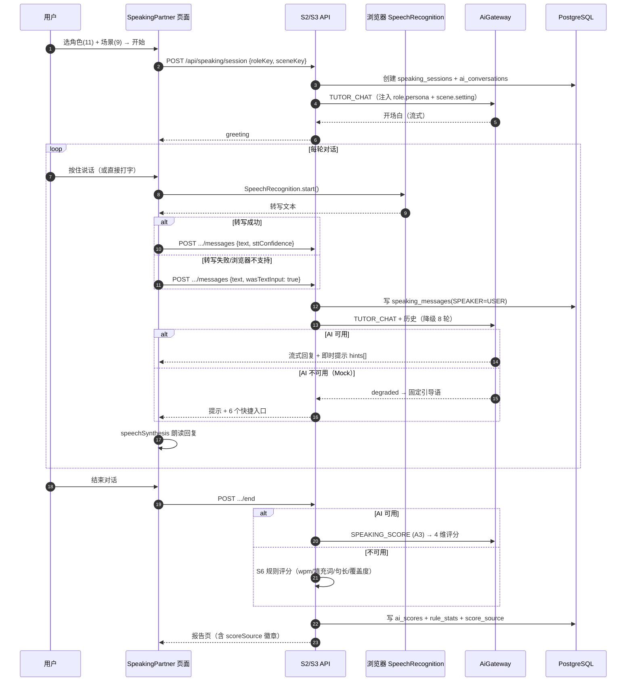
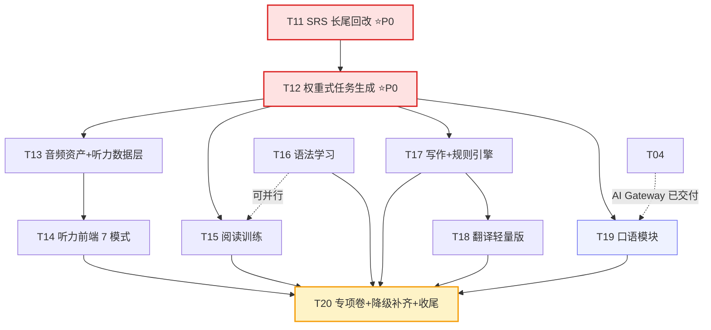

# EnglishAI · Phase 2 增量设计与任务分解

| 项目信息 | 内容 |
| --- | --- |
| 文档版本 | v1.0 |
| 作者 | 高见远 · Architect |
| 上游依据 | `docs/01-prd.md`、`docs/02-architecture.md` v1.2（§5.1.4 / §5.2.2 裁决）、`docs/03-qa-report.md`（Phase 1 PASS） |
| 下游交付对象 | 工程师（Phase 2 编码唯一依据） |
| 基线 | Phase 1 已交付：52 表 + seed + 认证/RBAC/SRS/Placement/Dashboard/错题/成就/Analytics/AI Gateway(18 能力 Mock)/i18n/三态 |
| 质量门禁（不得回退） | `vitest` 全绿 · `tsc` 0 错 · `lint` 0 错 · 核心算法覆盖率门禁已生效 |

> **纪律**：本任务仅产出本文件。**未修改 `src/`、`prisma/`、其他 docs**。

---

## 零、Phase 1 交付基线实测核对（设计前的事实校验）

设计不能只依赖文档陈述。我直接核对了代码与 seed，**发现 3 处「文档说已交付、实际未落地」的缺口**，它们直接决定 Phase 2 的排期：

| 核对项 | 文档/任务书声称 | **实测** | 影响 |
| --- | --- | --- | --- |
| E2E `exam-submit` 覆盖模拟考试 | 8 条主链路含"考试提交" | ⚠️ 该 spec 实际**走的是 Placement UI 流程**（`exam-submit.spec.ts:8-30`），**并非 CET 考试**。全仓库**无 `exam.service.ts`**，`exam_papers` / `exam_questions` **无任何 seed** | CET 考试是**从零新建**，不是"补全" |
| E2E `writing-analyze` 覆盖写作批改 | 写作批改链路 | ⚠️ 该 spec 实际打的是 `POST /api/ai/diagnosis`（`writing-analyze.spec.ts:9`），**未走写作提交**。`writing_submissions` 表存在但**无页面、无 service** | 写作是**从零新建** |
| 听力音频可用 | 20 篇听力材料 | ⚠️ `seed-content.ts:156` 写 `audioUrl = /audio/listening/{slug}.mp3`，但**`public/` 目录不存在** → 全部为**死链** | 听力播放器需先解决音频资产 |
| AI 降级覆盖 18 能力 | 18 能力全部可降级 | ⚠️ `degrade.ts` `switch` 仅覆盖 **8 个**（WORD_EXPLAIN / WRITING_REVIEW / DAILY_DIAGNOSIS / PLAN_GENERATE / PLAN_ADJUST / RECOMMEND / CET_ADVICE / TUTOR_CHAT），其余 10 个落 `default: return null` | Phase 2 新增能力需同步补降级 |
| 翻译 / 语法 service | — | ❌ 无 `translation.service.ts`、无 `grammar.service.ts`（但内容已 seed） | 语法/翻译前端可直接建 |

**结论**：Phase 2 不是"补功能"，而是**建 7 个新 service + 补 3 个前端域**。工期估算须按新建计。

---

## 一、Phase 2 范围界定

### 1.1 纳入 Phase 2（9 项）

| # | 功能 | 理由 | 依赖 |
| --- | --- | --- | --- |
| **P0-a** | **SRS 长尾回改**（`ADVANCE_INTERVALS` → 8 档 + 毕业三级递进） | 架构 §5.1.4 裁决 B-1。**不改则 M2 指标数学上不成立**（5000 词稳态 167 词/天 ≈ 22min 吃满预算） | 无 |
| **P0-b** | **权重式任务生成**（§5.2.2 规格） | PRD「千人千面」核心卖点 | a（可并行） |
| 1 | **语法学习** | 内容已 seed（14 类 + 题），**只缺前端**，成本最低、价值最高 | — |
| 2 | **听力训练**（7 模式） | PRD R014-R019，闭环必需 | 音频资产 |
| 3 | **阅读训练**（quiz + 定位 + 划词） | 内容已 seed 60 篇，只缺前端 + quiz | — |
| 4 | **写作训练 + AI 批改** | R028-R032，A2 能力 | — |
| 5 | **AI Tutor 对话** | A10，差异化卖点 | — |
| 6 | **翻译训练**（轻量版） | R026-R027，A11 | — |
| 7 | **口语训练**（对话 + 文本级评分） | A3+A10 | 见 §六 |

### 1.2 降级到 Phase 3（3 项，**我建议调整 team-lead 的范围**）

| 功能 | team-lead 原建议 | **我的建议** | 理由（诚实评估） |
| --- | --- | --- | --- |
| **完整 CET-4/6 模拟考试** | 进 Phase 2 | **降 Phase 3**，Phase 2 只做「**专项训练卷**」 | ① **710 分制换算缺标定样本**。架构 §11 Q16 明确「需 ≥100 份真实样本（测试分 vs 实际 CET 分）才能回归标定」。Phase 2 无样本，做出来的分数是**编造的**，会误导用户备考。② 依赖写作主观题 AI 阅卷（A17），而 AI 全 Mock 阶段 `EXAM_ESSAY_SCORE` 只能返回模板分。**先给诚实的"能力画像 + 弱项诊断"，不给虚假的分数。** |
| **整篇翻译练习** | 进 Phase 2 | **降 Phase 3**，Phase 2 只做「单词/句子翻译 + 一键入生词本」 | 翻译是**工具型**功能，不是学习闭环节点。整篇翻译练习依赖 `TRANSLATION_REVIEW`（长文本评分，Phase 2 无 AI 能力） |
| **发音音素级评分（A4）** | （在口语内） | **降 Phase 3** | 浏览器 Web Speech API **不返回音素/置信度**，物理上做不了音素级评分。详见 §六.2 |

### 1.3 Phase 2 目标用户价值（一句话）

> 用户能**独立完成一天的听说读写闭环**：早上背词 → 上午做语法/阅读专项 → 下午和 AI 对话练口语 → 晚上提交一篇作文拿到 AI 批改 → 睡前做听力。所有失败路径都有降级兜底，**没有 AI 也能用**。

---

## 二、数据库增量设计

### 2.1 新增表（3 张）

#### `SpeakingCatalog` — 口语场景/角色配置（字典表，替代 Phase 1 的硬编码 String）

```prisma
/// 口语角色（11 种：friend/teacher/interviewer/tourist/classmate/boss/colleague/client/waiter/airport_staff/hotel_clerk）
model SpeakingRole {
  id          String  @id @default(cuid())
  key         String  @unique          // friend | teacher | interviewer | ...
  nameZh      String
  nameEn      String
  /// 角色设定 Prompt 片段，注入 TUTOR_CHAT system prompt
  persona     String  @db.Text
  avatarUrl   String?
  /// 难度基线 1-3，影响 AI 用词与语速
  level       Int     @default(1)
  /// 默认场景
  defaultScenes Json                    // ["restaurant","airport"]
  sortOrder   Int     @default(0)
  isActive    Boolean @default(true)
  createdAt   DateTime @default(now())
  updatedAt   DateTime @updatedAt

  @@map("speaking_roles")
}

/// 口语场景（9 种：restaurant/airport/hotel/shopping/university/interview/business_meeting/travel/daily）
model SpeakingScene {
  id          String  @id @default(cuid())
  key         String  @unique
  nameZh      String
  nameEn      String
  /// 场景设定 Prompt 片段
  setting     String  @db.Text
  /// 目标产出引导：[{key, prompt}] 如 {key:'ask_price', prompt:'问清楚总价'}
  goals       Json?
  difficulty  Difficulty @default(MEDIUM)
  cefrLevel   CEFRLevel?
  coverUrl    String?
  sortOrder   Int     @default(0)
  isActive    Boolean @default(true)
  createdAt   DateTime @default(now())
  updatedAt   DateTime @updatedAt

  @@map("speaking_scenes")
}

/// 听力材料的多语速音频资产（TTS 生成，一次生成多档）
model ListeningAudioAsset {
  id          String  @id @default(cuid())
  materialId  String
  /// 语速档：0.75 | 1.0 | 1.25（倍速，Float）
  rate        Float   @default(1.0)
  url         String
  /// 音素/音高数据，供波形与跟读对齐
  durationSec Int
  fileSize    Int?
  /// 是否为 TTS 合成（false = 真人录音）
  isTts       Boolean @default(true)
  voiceName   String?                     // edge-tts voice，如 en-US-AriaNeural
  createdAt   DateTime @default(now())

  material ListeningMaterial @relation(fields: [materialId], references: [id], onDelete: Cascade)

  @@unique([materialId, rate])
  @@index([materialId])
  @@map("listening_audio_assets")
}
```

### 2.2 Phase 1 表加字段（5 张）

```prisma
// ListeningMaterial：加语速资产关联 + 训练模式统计
model ListeningMaterial {
  // ...（Phase 1 全部字段保持不变）...
  audioUrls          Json?      // 预生成三档：[{"rate":0.75,"url":"..."},{"rate":1.0,"url":"..."}]
  /// 训练强度阶梯：1=泛听 2=精听 3=听写 4=逐句跟读
  intensityLevel    Int        @default(1)
  /// 生词/考点：[{word, meaning, startSec, type:'new'|'key'|'phrase'}]
  focusPoints       Json?
  /// 关联音效
  assets            ListeningAudioAsset[]
  // ...（原 relations 保持）...
}

// SpeakingSession：加"无 AI 也能评"所需字段
model SpeakingSession {
  // ...（Phase 1 字段保持不变）...
  /// 音频保留策略：'discard' | 'temp_24h'（合规，见架构 §11 Q13）
  audioRetention   String    @default("discard")
  /// STT 提供方：web_speech | cloud_asr | manual（用户手动输入）
  sttProvider      String    @default("web_speech")
  /// STT 置信度 0-1，web_speech 通常为 null
  sttConfidence    Float?
  /// 用户用文本模式（无法录音时），保证评分链路仍可跑通
  wasTextInput     Boolean   @default(false)
  /// 降级评分来源：'ai' | 'rule'（rule = 纯统计规则，Mock/无 Key 时）
  scoreSource      String    @default("ai")
  /// 规则评分：{wpm, pauseCount, avgSentenceLen, fillerWords, stats:{}}
  ruleStats        Json?
  // ...（原 relations 保持）...
}

// WritingSubmission：加"规则引擎降级"必需字段
model WritingSubmission {
  // ...（Phase 1 字段保持不变）...
  /// 规则引擎结果（拼写/句长/段落/连接词/时态），AI 不可用时作为基础分
  ruleCheckScore   Int?      // 0-100
  ruleCheckDetail  Json?     // {spelling:[], sentenceLength:{avg,max}, paragraphs, connectors, passiveVoice}
  scoreSource      String    @default("ai")   // 'ai' | 'rule'
  /// 提交时快照字数要求，便于后续评估
  requiredWords    Int?
  /// 4 个改写风格是否已生成（basic/college/cet/advanced/spoken）
  rewriteStyles    Json?     // {basic:true, cet:true, ...}
  /// 批改轮次（用户多次提交同一作文）
  revision         Int       @default(0)
  // ...（原 relations 保持）...
}

// StudyTask：权重式生成的幂等键与权重溯源
model StudyTask {
  // ...（Phase 1 字段保持不变）...
  /// 生成本任务的触发来源：ONBOARDING | PLACEMENT_COMPLETED | DAILY_CRON | PLAN_ADJUST
  source          String    @default("DAILY_CRON")
  /// 生成时各模块权重快照 {VOCAB:0.32, LISTENING:0.28, ...}，供归因分析
  weightSnapshot  Json?
  /// 弱项优先命中项 {LISTENING: 30}（分数越低越优先）
  weakHits        Json?
  // ...（原 relations 保持）...
}

// UserSettings：口语/听力相关偏好
model UserSettings {
  // ...（Phase 1 字段保持不变）...
  /// 听力默认语速档 0.75 | 1.0 | 1.25
  listeningRate     Float    @default(1.0)
  /// 是否自动播放下一句
  autoPlayNext      Boolean  @default(true)
  /// 口语是否启用录音（false = 文本模式）
  micEnabled        Boolean  @default(true)
  /// 录音后是否上传（默认 false，架构 §11 Q13 合规）
  uploadAudio       Boolean  @default(false)
  // ...（原 relations 保持）...
}
```

### 2.3 新增枚举（3 个）

```prisma
/// 听力训练模式（PRD §5.6 的 7 种）
enum ListeningMode {
  INTENSIVE      // 精听：逐句暂停 + 听写
  EXTENSIVE      // 泛听：整篇播放 + 理解题
  DICTATION      // 听写：整段默写 + 原文比对
  CHOICE         // 选择题
  KEYWORD        // 关键词捕捉：听填关键词
  RETELL         // 复述：听写后口头复述（Phase 3 接录音）
  CLOZE          // 完形填空听音
}

/// 听力生词/考点类型
enum FocusPointType {
  NEW_WORD
  KEY_WORD
  PHRASE
  GRAMMAR
}

/// 任务生成来源（与 §5.2.2 规格一致）
enum TaskSource {
  ONBOARDING
  PLACEMENT_COMPLETED
  DAILY_CRON
  PLAN_ADJUST
  MANUAL
}
```

**Phase 2 schema 完成后：52 → 55 张表**（+3 表，+3 枚举）。

> **迁移注意**：`ALTER TABLE` 加字段全部带 `DEFAULT`，可零停机；`ListeningAudioAsset.materialId` 外键级联 `onDelete: Cascade`；`listening_audio_assets` 建 `@@unique([materialId, rate])` 防重复生成。

---

## 三、API 增量清单（新增 34 条 / 修改 3 条）

> 沿用架构 §3.1 envelope `{success,data,error,traceId}`、§3.2 的 30 码表、§3.3 分页/幂等约定、`withApi/withAuth` 包装。权限图例同 §3.5：**P**=PUBLIC · **U**=USER。

### 3.1 听力训练（8 条 · 新增）

| # | Method | Path | 说明 | 权限 | 请求关键字段 | 响应关键字段 | 流式 |
| --- | --- | --- | --- | --- | --- | --- | --- |
| L1 | GET | `/api/listening` | 材料列表（Phase 2 扩展筛选） | U | `category?,difficulty?,cefr?,intensity?,page` | `materials[],categories[],facets{}` | |
| L2 | GET | `/api/listening/:id` | 精听页数据 | U | — | `audioUrl,audioUrls[3],transcript[],translation,intensityLevel,focusPoints[]` | |
| L3 | GET | `/api/listening/:id/questions` | 按模式取题 | U | `mode:ListeningMode` | `questions[]` | |
| L4 | POST | `/api/listening/:id/attempts` | 提交训练结果 | U | `mode,answers[],durationSec,unknownWords[],dictationText?` | `recordId,accuracy,correctCount,dictationDiff?` | |
| L5 | GET | `/api/listening/report/:recordId` | 训练报告 | U | — | `accuracy,unknownWords[],focusPoints[],ruleStats{},ai{degraded}` | |
| L6 | POST | `/api/listening/:recordId/analyze` | AI 听力分析（A12） | U | — | `analysis{suggestions[],weakSpots[],nextMaterials[]},ai{degraded}` | |
| L7 | POST | `/api/listening/progress` | 保存播放进度 | U | `materialId,positionSec,playbackRate,completed?` | `ok` | |
| L8 | GET | `/api/listening/dictation-check` | 听写比对（纯本地 diff，不调 AI） | U | `original,dictation` | `{diff:[{token,type,index}],accuracy}` | |

> **L8 决策**：听写批改是**确定性问题**（字符串 diff），**不走 AI**。零成本、零延迟、无降级问题。

### 3.2 口语训练（7 条 · 新增）

| # | Method | Path | 说明 | 权限 | 请求关键字段 | 响应关键字段 | 流式 |
| --- | --- | --- | --- | --- | --- | --- | --- |
| S1 | GET | `/api/speaking/catalog` | 11 角色 × 9 场景（改读 `speaking_roles/scenes` 表） | U | — | `roles[],scenes[]` | |
| S2 | POST | `/api/speaking/session` | 创建会话 | U | `roleKey,sceneKey,mode=partner\|pronunciation,conversationId?` | `sessionId,conversationId,greeting{text}` | |
| S3 | POST | `/api/speaking/session/:id/messages` | 发送一条（文本或录音转写结果） | U | `text?,sttConfidence?,wasTextInput?,sessionId` | `reply{text,hints[]},latencyMs,ai{degraded}` | ✓ |
| S4 | POST | `/api/speaking/session/:id/end` | 结束并评分（A3） | U | — | `reportId,scores{},scoreSource,ai{degraded}` | |
| S5 | GET | `/api/speaking/report/:id` | 评分报告 | U | — | `scores{total,grammar,vocabulary,fluency,naturalness},corrections[],suggestions[],ruleStats{}` | |
| S6 | POST | `/api/speaking/rule-score` | **纯规则评分**（无 AI 兜底路径） | U | `transcript,durationSec,pauseCount,targetWords` | `ruleStats{wpm,fillerWords,avgSentenceLen,coverage},score` | |
| S7 | GET | `/api/speaking/sessions` | 历史会话 | U | `page,sceneKey?` | `sessions[]` | |

> **S6 决策**：新增**纯规则评分**端点。它不依赖任何 AI，是 `degrade.ts` 中 `SPEAKING_SCORE` 的兜底数据源，保证 Mock 阶段口语评分**也有真实可用的数字**（基于语速/填充词/句长/目标句覆盖度），而不是一句"AI 不可用"。

### 3.3 阅读训练（4 条 · 新增）

| # | Method | Path | 说明 | 权限 | 请求关键字段 | 响应关键字段 | 流式 |
| --- | --- | --- | --- | --- | --- | --- | --- |
| R1 | GET | `/api/reading` | 文章列表 | U | `category?,difficulty?,cefr?,page` | `articles[],facets{}` | |
| R2 | GET | `/api/reading/:id` | 文章详情（含进度恢复） | U | — | `contentBlocks[],contentZh,keyWords[],sentences[],readingMinutes,progress` | |
| R3 | POST | `/api/reading/:id/quiz/submit` | 提交理解题 | U | `answers[]` | `score,results[{questionId,correct,explanation,location}],wrongSaved` | |
| R4 | POST | `/api/reading/:id/explain` | AI 阅读讲解（A5） | U | `scope=main\|sentence\|vocab,targetSentences?,unknownWords?` | `{mainIdea,background,sentenceAnalysis[],vocabNotes[]}` | ✓ |

### 3.4 写作训练 + AI 批改（5 条 · 新增）

| # | Method | Path | 说明 | 权限 | 请求关键字段 | 响应关键字段 | 流式 |
| --- | --- | --- | --- | --- | --- | --- | --- |
| W1 | GET | `/api/writing/tasks` | 写作任务列表 | U | `taskType?,difficulty?,examType?,page` | `tasks[]` | |
| W2 | POST | `/api/writing/submissions` | 新建草稿 | U | `taskId,title?` | `submissionId,wordLimit` | |
| W3 | PATCH | `/api/writing/:id` | 自动保存（≤3s 防抖） | U | `content` | `savedAt,wordCount,paragraphCount,ruleCheck{}}` | |
| W4 | POST | `/api/writing/:id/analyze` | **AI 批改（A2）** | U | `targetLevel?,requestRewrites?` | `scores{},corrections[],rewrites{},summary,ruleCheck{},scoreSource,ai{degraded}` | ✓ |
| W5 | GET | `/api/writing/:id/report` | 批改报告 | U | — | 同 W4 + `revision` | |

> **W3 增强**：保存时**同步返回 `ruleCheck`**（纯本地规则引擎，零延迟），用户边写边看到拼写/句长/连接词提示，**不依赖 AI 也不等 AI**。这是写作模块体验的关键。

### 3.5 语法 / 翻译（5 条 · 新增）

| # | Method | Path | 说明 | 权限 | 请求关键字段 | 响应关键字段 | 流式 |
| --- | --- | --- | --- | --- | --- | --- | --- |
| G1 | GET | `/api/grammar/topics` | 14 类语法 + 掌握度 | U | `category?` | `topics[{id,name,category,mastery,questionCount}]` | |
| G2 | GET | `/api/grammar/:id` | 知识点详情 | U | — | `content,examples[],errorExamples[]` | |
| G3 | GET | `/api/grammar/:id/exercise` | 练习题 | U | `limit?=10,difficulty?` | `questions[]` | |
| G4 | POST | `/api/grammar/:id/exercise/submit` | 提交（错题自动入库） | U | `answers[],responseMs[]` | `score,results[],wrongSaved` | |
| G5 | POST | `/api/grammar/:id/explain` | AI 语法讲解（A6） | U | `question,userErrors[]` | `{answer,explanation,examples[],miniExercise}` | ✓ |
| T1 | POST | `/api/translation/translate` | AI 翻译五档（A11） | U | `sourceText,direction,mode=single\|sentence` | `{literal,natural,formal,academic,spoken,notes}` | ✓ |
| T2 | POST | `/api/translation/save` | 收藏入生词本/句子本 | U | `sourceText,result,targetWords[]` | `saved,favoriteId` | |
| T3 | GET | `/api/translation/history` | 翻译历史 | U | `page` | `records[]` | |

### 3.6 AI Tutor 对话（3 条 · 新增）

| # | Method | Path | 说明 | 权限 | 请求关键字段 | 响应关键字段 | 流式 |
| --- | --- | --- | --- | --- | --- | --- | --- |
| A1 | GET | `/api/ai/conversations` | 会话列表 | U | `type?,page` | `conversations[]` | |
| A2 | POST | `/api/ai/conversations` | 新建会话 | U | `type:ConversationType,context{roleKey,sceneKey,level,goal}` | `conversationId` | |
| A3 | GET | `/api/ai/conversations/:id/messages` | 消息历史 | U | `page` | `messages[]` | |
| A4 | POST | `/api/ai/chat` | **Tutor 流式对话（A10）** | U | `conversationId,message,level,goal,sceneKey?,roleKey?` | SSE `delta{text}` | **✓** |

> Phase 1 已有 `POST /api/ai/chat` 与 `/api/ai/diagnosis`，Phase 2 **复用不改协议**，仅新增 `roleKey/sceneKey` 入参用于场景化 Prompt 注入。

### 3.7 专项训练卷（考试，3 条 · 新增）

| # | Method | Path | 说明 | 权限 | 请求关键字段 | 响应关键字段 | 流式 |
| --- | --- | --- | --- | --- | --- | --- | --- |
| E1 | GET | `/api/exams` | 试卷列表（仅专项训练卷） | U | `examType?,page` | `papers[]` | |
| E2 | POST | `/api/exams/:id/start` | 开始作答 | U | — | `attemptId,deadlineAt,serverTime,questions[]` | |
| E3 | POST | `/api/exams/attempts/:id/submit` | 交卷评分（**只算客观题**） | U | `Idempotency-Key` | `attemptId,totalScore,sectionScores{},wrongQuestionCount` | |

> **Phase 2 边界**：**不做 710 分制换算、不做写作主观题 AI 阅卷**。只报"正确率 + 分项正确率 + 错题入库"，报告中**显式标注"专项训练卷，非 CET 全真模考"**。原因见 §1.2。

### 3.8 修改既有 API（3 条）

| # | Method | Path | 变更 | 兼容策略 |
| --- | --- | --- | --- | --- |
| M1 | POST | `/api/onboarding` | 响应新增 `planRegenerateHint`：Placement 完成后会重算未完成任务 | 纯增量，客户端忽略即可 |
| M2 | GET | `/api/dashboard` | `todayTasks[]` 新增 `weightSnapshot`、`weakHits` 字段；新增 `reviewLoadEta`（复习负担预估秒数） | 纯增量 |
| M3 | GET | `/api/vocabulary/review-queue` | 响应新增 `etaSeconds`（预计完成本轮所需秒数）、`ladderHint`（下次进阶梯预测） | 纯增量 |

---

## 四、AI 能力映射与 Mock 降级兜底

### 4.1 Phase 2 功能 → A1-A18 能力映射

| 功能 | 用到的能力 | 数量 | Mock 阶段表现 |
| --- | --- | --- | --- |
| 听力训练（报告分析） | `LISTENING_ANALYZE`(A12) | 1 | 纯统计兜底（正确率/生词数/难度），隐藏 AI 块 |
| 听力 AI 建议 | `LISTENING_ANALYZE`(A12) | 1 | 同上 |
| 口语对话 | `TUTOR_CHAT`(A10) | 1 | 固定引导语 + 6 快捷入口 |
| 口语评分 | `SPEAKING_SCORE`(A3) | 1 | **规则评分**（S6 端点真实计算） |
| 阅读讲解 | `READING_EXPLAIN`(A5) | 1 | 隐藏 AI 块，保留原文+词典+预置题 |
| 阅读出题 | `READING_QUIZ_GENERATE`(A14) | 1 | 用预置题（Phase 1 seed 已有 `reading_questions`） |
| 写作批改 | `WRITING_REVIEW`(A2) | 1 | **规则引擎**（拼写/句长/连接词/段落/被动语态） |
| 语法讲解 | `GRAMMAR_EXPLAIN`(A6) | 1 | 静态知识点 + 例句 + 错误示例 |
| 翻译 | `TRANSLATE`(A11) | 1 | 词典直译（仅 `literal` 档） |
| 任务生成 | `PLAN_GENERATE`(A7) `PLAN_ADJUST`(A8) `RECOMMEND`(A16) | 3 | 规则模板（Phase 1 已有） |
| 错题分类 | `MISTAKE_CLASSIFY`(A13) | 1 | 显示正确答案+知识点，分类"未分类" |
| CET 建议 | `CET_ADVICE`(A18) | 1 | 规则文案（Phase 1 已有） |
| 考试作文评分 | `EXAM_ESSAY_SCORE`(A17) | — | **Phase 2 不使用**（移 Phase 3） |
| 发音评分 | `PRONUNCIATION_ANALYZE`(A4) | — | **Phase 2 不使用**（移 Phase 3） |

**Phase 2 实际启用 13 / 18 项能力**，比 Phase 1 的 8 项增加 5 项。

### 4.2 必须补齐的降级兜底（`degrade.ts` 从 8 → 13 项）

Phase 1 `degrade.ts` 的 `switch` 只覆盖 8 个能力，其余落 `default: return null`。Phase 2 新增 5 个能力**必须同步补降级**，否则会出现"白屏 + 无兜底"：

```ts
// src/services/ai/degrade.ts —— Phase 2 需新增的 5 个 case
case 'SPEAKING_SCORE': return {
  total: 0, grammar: null, vocabulary: null, fluency: null, naturalness: null,
  summary: 'AI 评分暂不可用，已切换为口语统计分析',
  ruleStats: computeRuleStats(input.transcript, input.durationSec),  // ← 真实计算，非空壳
}
case 'LISTENING_ANALYZE': return {
  suggestions: ['先用「精听」模式逐句听写，定位连读与弱读问题'],
  weakSpots: input.unknownWords.slice(0, 10).map(w => ({ word: w, type: 'unknown' })),
  nextMaterials: [],
}
case 'READING_EXPLAIN': return null   // 隐藏 AI 区块（架构 §4.7 已规定）
case 'READING_QUIZ_GENERATE': return {
  questions: input.fallbackQuestions ?? [],   // ← 回落 seed 预置题
  source: 'preset',
}
case 'GRAMMAR_EXPLAIN': return {
  answer: input.answer, explanation: input.staticExplanation,
  examples: input.examples, miniExercise: null, source: 'static',
}
case 'WRITING_REVIEW': return {
  scores: null, corrections: ruleEngineCheck(input.essayText),   // ← 规则引擎真实结果
  rewrites: {}, summary: 'AI 批改暂不可用，已切换为基础规则检查', scoreSource: 'rule',
}
```

**验收标准**：13 个能力在 `AI_PROVIDER=mock` 下单独调用，**全部返回结构合法（非 null）**，且写作/口语两条链路返回的兜底内容**必须包含真实计算结果**（不是静态文案）。

### 4.3 Token 配额调整建议

| 能力 | 每日/用户 | 理由 |
| --- | --- | --- |
| `WRITING_REVIEW` | 20 | 一天最多写 2 篇作文，超出无意义 |
| `SPEAKING_SCORE` | 60 | 一次会话 1 次评分 |
| `TUTOR_CHAT` | 100 | Phase 1 默认值 |
| `READING_EXPLAIN` | 50 | — |
| `LISTENING_ANALYZE` | 50 | — |
| `GRAMMAR_EXPLAIN` | 50 | — |
| `TRANSLATE` | 100 | — |
| 其余 | 100 | Phase 1 默认 |

> 单用户日总上限仍为 **100**（`AI_USER_DAILY_QUOTA`），上表是**分能力二次限流**，防某单一能力吃掉全部配额。

---

## 五、听力内容与技术策略

### 5.1 关键决策：音频资产怎么来（Phase 1 的死链必须解决）

Phase 1 `seed-content.ts:156` 写入 `audioUrl = /audio/listening/{slug}.mp3`，但**仓库无 `public/` 目录、无任何 mp3 文件** → 20 篇材料全部是死链，播放器必然报错。

| 方案 | 成本 | 保真度 | 版权 | 结论 |
| --- | --- | --- | --- | --- |
| **A. Edge TTS 批量生成**（`npx edge-tts` / Azure Edge 免费端点） | 零 | 中（机械朗读，**无自然语调/连读真实感**） | ✅ 无版权问题（合成语音） | ✅ **选作 Phase 2 默认** |
| B. 真人录音 | 高（需配音/采购） | 高 | ⚠️ 需授权 | Phase 3 |
| C. 免费素材站音频 | 低 | 中 | ⚠️ 授权不明 | ❌ 不用 |

**决策：A 方案 + 明示局限。**

```bash
# scripts/gen-listening-audio.ts（新增）
# 1) 读 listening_materials（transcript 逐句拼接为朗读稿）
# 2) 调 edge-tts，每篇生成 3 档语速
npx edge-tts --voice en-US-AriaNeural --rate=-25% --text "..." --write-media public/audio/listening/{slug}_075.mp3
npx edge-tts --voice en-US-AriaNeural --rate=+0%  --text "..." --write-media public/audio/listening/{slug}_100.mp3
npx edge-tts --voice en-US-AriaNeural --rate=+25% --text "..." --write-media public/audio/listening/{slug}_125.mp3
# 3) ffprobe 取时长 → 写 listening_audio_assets
# 4) 回填 listening_materials.audioUrls
```

**局限与应对（必须写进 UI）**

| 局限 | 应对 |
| --- | --- |
| 机械朗读，无语调变化 | 听力页顶部标注"AI 合成语音（Phase 2）"；`/listening` 列表页显示"真人音频 Phase 3 上线" |
| 无真实连读/弱读 | 训练模式设计为**可反复精听**（这恰好是 TTS 的优势：可无限次重复、无真人语速限制） |
| 音素级对齐不准 | 字幕时间轴**不用 TTS 输出**，用脚本按词数比例估算（现有 `transcript` 已有 `startSec/endSec`，seed 时人工标注） |

### 5.2 内容规模与难度阶梯

| 阶段 | 篇数 | 阶梯设计 |
| --- | --- | --- |
| Phase 1（已交付） | 20 | 4 难度 × 5 篇（E/M/H × 2） |
| **Phase 2（目标）** | **60** | **5 难度档 × 12 篇** |

**难度阶梯（`intensityLevel` 1-4 双维度）**

| intensityLevel | 名称 | 时长 | 词数 | WPM | 目标 | 内容来源 |
| --- | --- | --- | --- | --- | --- | --- |
| 1 | 泛听入门 | 60–90s | 90–120 | 90–110 | CET-4 短对话/短文 | campus/daily |
| 2 | CET-4 标准 | 120–180s | 160–220 | 120–140 | CET-4 篇章 | cet4 |
| 3 | CET-6 强化 | 180–260s | 260–340 | 140–160 | CET-6 篇章 | cet6/news |
| 4 | 高阶精听 | 240–360s | 340–450 | 150–170 | 讲座/长对话 | news/academic |

**语速档**：`intensityLevel` 决定**推荐播放语速**（1→1.0x，2→1.0x，3→0.75x，4→0.75x），用户可手动覆盖 0.75/1.0/1.25。

**7 种训练模式与难度档的对应**

| 模式 | 适用档 | 答案来源 | 判分方式 |
| --- | --- | --- | --- |
| `EXTENSIVE` 泛听 | 1–4 | 理解题 | 客观题判分 |
| `CHOICE` 选择 | 1–4 | `listening_questions` | 客观题判分 |
| `CLOZE` 完形 | 2–4 | `listening_questions` | 客观题判分 |
| `KEYWORD` 关键词捕捉 | 2–4 | 脚本 `focusPoints` | **字符串模糊匹配**（允许 1 个字符容错） |
| `INTENSIVE` 精听 | 1–4 | 无（逐句听） | 无判分，纯练习 |
| `DICTATION` 听写 | 1–4 | `transcript` 原文 | **本地 diff**（L8 端点，零 AI） |
| `RETELL` 复述 | 3–4 | AI 评估 | **Phase 3**（需录音）→ Phase 2 显示"即将上线" |

> **关键决策：7 模式中 6 个在 Phase 2 可用，判分全部走确定性算法（客观题/字符串 diff），0 个依赖 AI。** AI 只在"报告分析"和"下一步建议"两处介入（A12）。这让听力模块在 Mock 阶段也是**完整可用**的。

---

## 六、口语技术策略

### 6.1 方案选型（三选一）

| 方案 | 组成 | 评分维度 | 成本 | 延迟 | 结论 |
| --- | --- | --- | --- | --- | --- |
| A. 纯 Web Speech + 规则评分 | `SpeechRecognition` + `speechSynthesis` + `S6` 规则引擎 | 语法/词汇/流利度/自然度（**文本级 4 维**） | 零 | <1s | ✅ **Phase 2 默认** |
| B. 云 ASR + 文本评分 | 讯飞/阿里 ASR + A3 | 同 A（文本级 4 维） | 需 Key，¥0.001/次 | 1–3s | Phase 3 备选 |
| C. 云 ASR + 音素级评分 | 云 ASR + 发音评测 API | A4 的 5 维（含发音准确度） | 需 Key + 评测引擎 | 2–4s | **Phase 3** |

**决策：A 方案。**

### 6.2 为什么 Phase 2 不做发音评分（关键技术取舍，必须说清）

`SpeechRecognition` API **不返回音素级信息，也不返回可靠的置信度**（Chrome 桌面版 `confidence` 常为 `0` 或 `null`）。因此：

| 想要的能力 | 浏览器 API 能否支撑 |
| --- | --- |
| 语法准确性（时态/冠词/主谓一致） | ✅ 可以（转写文本 → 规则/AI） |
| 用词丰富度 | ✅ 可以 |
| 流利度（语速/填充词/停顿） | ✅ 可以（`MediaRecorder` 时长 + 文本） |
| 自然度（地道表达） | ✅ 可以（文本对比） |
| **发音准确度 / 音素 / 重音** | ❌ **不能**（无音素数据） |

**因此 Phase 2 明确不做 A4 音素评分**，UI 上**直接不展示"发音"维度**，避免给用户一个永远 0 分或虚假分数的维度。这是诚实的产品决策 —— 比做一个假的"发音 85 分"强。

**Phase 3 升级路径（接口已预留）**：`SpeakingSession.sttProvider` 字段已支持 `'web_speech' | 'cloud_asr' | 'manual'`；接入云 ASR 只需实现 `SttProvider` 接口，**不改表结构**。

### 6.3 会话流程（Phase 2 实现）



### 6.4 规则评分算法（S6，Mock 阶段的核心兜底）

```ts
export interface RuleScoreInput { transcript: string; durationSec: number; pauseCount?: number; targetWords?: string[] }
export interface RuleScoreOutput { wpm: number; fillerCount: number; avgSentenceLen: number; coverage: number; score: number }

export function ruleScore(i: RuleScoreInput): RuleScoreOutput {
  const words = i.transcript.trim().split(/\s+/).filter(Boolean)
  const wpm = Math.round(words.length / Math.max(i.durationSec / 60, 0.1))   // 语速
  const FILLERS = ['um', 'uh', 'er', 'like', 'you know', 'i mean', 'basically']
  const fillerCount = FILLERS.reduce((n, f) => n + (i.transcript.toLowerCase().match(new RegExp(`\\b${f}\\b`, 'g'))?.length ?? 0), 0)
  const sentences = i.transcript.split(/[.!?]+/).filter(s => s.trim())
  const avgSentenceLen = Math.round(words.length / Math.max(sentences.length, 1))
  // 目标句覆盖度：说出场景关键表达的比例
  const coverage = i.targetWords?.length
    ? i.targetWords.filter(t => i.transcript.toLowerCase().includes(t.toLowerCase())).length / i.targetWords.length
    : 0.6

  // 分数：语速最优区间 100-150 wpm 得分最高；句长 8-18 最佳；填充词与覆盖度扣分
  const wpmScore   = wpm >= 100 && wpm <= 150 ? 100 : Math.max(0, 100 - Math.abs(wpm - 125) * 1.2)
  const lenScore   = avgSentenceLen >= 8 && avgSentenceLen <= 18 ? 100 : Math.max(0, 100 - Math.abs(avgSentenceLen - 13) * 6)
  const fillerScore = Math.max(0, 100 - fillerCount * 12)
  const score = Math.round(wpmScore * 0.3 + lenScore * 0.25 + fillerScore * 0.15 + coverage * 100 * 0.3)
  return { wpm, fillerCount, avgSentenceLen, coverage: Number(coverage.toFixed(2)), score: clamp(score, 0, 100) }
}
```

**验收标准**：给定 3 组固定 transcript + duration，输出 score 必须是**确定性可复现**的固定值（单测断言具体数字）。

---

## 七、任务分解 T11–T20（分 5 批）

> 规则：每批工程师 **1–2 天可完成**；标注依赖与**可测的验收标准**；每批结束 `vitest` + `tsc` + `lint` 三门禁必须绿。

### 批次 A：P0 数据与算法回改（先做，因为影响全局指标）

#### **T11 · SRS 长尾回改 + 复习负担预估** ⭐P0
- **依赖**：无
- **文件**：
  - `src/services/vocabulary/srs/srs.constants.ts`（`ADVANCE_INTERVALS` → `[1,3,7,14,30,60,120,240]`；新增 `GRADUATED_INTERVALS = [60,120,240]`、`MIN_GRADUATE_REPS = 5`）
  - `src/services/vocabulary/srs/formula.ts`（MASTERED 路径改三级递进：按 `reps` 取 `GRADUATED_INTERVALS[min(reps-5, 2)]`）
  - `src/services/vocabulary/srs/srs.engine.ts`（若已存在则改；否则新建，承载 `estimateReviewLoad()`）
  - `src/services/vocabulary/srs/index.ts`
  - `src/tests/srs.spec.ts`（补充长尾与毕业递进断言）
  - `src/tests/review-load.spec.ts`（新建）
- **验收标准**：
  1. `ADVANCE_INTERVALS.length === 8` 且末位为 `240`
  2. 单测：`reps=1..8` 连续答对，间隔序列断言为 `[1,3,7,14,30,60,120,240]`（EF=2.5 时）
  3. 单测：毕业递进 —— `mastery≥90 && consecutiveCorrect≥3` 后连续答对，间隔为 `60 → 120 → 240`
  4. 单测：`estimateReviewLoad(5000 词, 平均间隔 120 天)` 返回 **≤ 400 秒/天**
  5. **回归**：`vocabulary_reviews` 已有数据不被破坏（只影响新推进的 `nextReviewAt`）
  6. 覆盖率门禁：SRS 模块 **≥ 95%**（当前 97.79%，不得回退）

#### **T12 · 权重式任务生成 + 计划重建** ⭐P0
- **依赖**：T11（复习量影响 REVIEW 目标值）
- **文件**：
  - `src/services/plan/generator.ts`（**新建**：`generateDailyTasks()`，实现架构 §5.2.2 规格）
  - `src/services/plan/rebuild.ts`（**新建**：`rebuildTasks(trigger)`，处理三类触发时机）
  - `src/services/plan/cron.ts`（**新建**：`generateDailyTasksForAllUsers()`，每日 06:00 用户本地时区）
  - `src/services/onboarding.service.ts`（`generateFirstWeekTasks` 改调 `generator.ts`；加事务）
  - `prisma/schema.prisma`（`StudyTask` 加 `source/weightSnapshot/weakHits`；新增 `TaskSource` 枚举）
  - `src/app/api/study-plan/rebuild/route.ts`（**新建** `POST`，Placement 交卷后由前端调用）
  - `src/tests/plan-generator.spec.ts`（**新建**）
- **验收标准**：
  1. 单测覆盖 4 条分支：弱项加权 / 强项减权 / CET 加权 / 完成率降档（<0.5 → ×0.8）
  2. 单测：`listening=30` 弱项用户的听力分钟数 **≥ 2 倍**于 `listening=90` 用户
  3. 单测：CET4 目标用户 `SPEAKING` 占比 ≤ 5%，`READING + LISTENING` ≥ 45%
  4. **幂等**：同 `(userId, date, taskType)` 重跑不产生重复行（`@@unique` 约束 + `skipDuplicates`）
  5. **并发**：`generateFirstWeekTasks` 改为 `$transaction` + `upsert`，并发双提交不重复生成（修 QA #10）
  6. Placement 交卷 → `POST /api/study-plan/rebuild` → **未完成**任务被重算，**已完成**任务 `status` 保持 `COMPLETED` 不变

### 批次 B：听力模块

#### **T13 · 音频资产生成 + 听力数据层**
- **依赖**：T12
- **文件**：
  - `prisma/schema.prisma`（`ListeningMaterial` 加 `audioUrls/intensityLevel/focusPoints`；新增 `ListeningAudioAsset` 模型 + `ListeningMode`/`FocusPointType` 枚举）
  - `scripts/gen-listening-audio.ts`（**新建**：Edge TTS 批量生成 + ffprobe 时长 + 回填）
  - `prisma/seed/seed-listening-p2.ts`（**新建**：60 篇材料 + `focusPoints` + 7 模式题目）
  - `src/services/listening.service.ts`（**新建**）
  - `src/app/api/listening/route.ts`（改造 L1）
  - `src/app/api/listening/[id]/route.ts`（改造 L2）
  - `src/app/api/listening/[id]/questions/route.ts`（**新建** L3）
  - `src/app/api/listening/dictation-check/route.ts`（**新建** L8，纯 diff）
  - `src/tests/listening-dictation.spec.ts`（**新建**）
- **验收标准**：
  1. `public/audio/listening/` 下**实际存在 60×3 = 180 个 mp3 文件**（不再是死链）
  2. DB：`listening_materials` 60 行、`listening_audio_assets` 180 行、每行 `durationSec > 0`
  3. `GET /api/listening/:id` 返回 `audioUrls` 长度 3，语速分别为 0.75/1.0/1.25
  4. `POST /api/listening/dictation-check` 对固定输入返回**确定性** diff 与 accuracy（单测断言具体值）
  5. 音频生成脚本**可重复执行**（已存在文件跳过），`npm run audio:gen -- --only=cet4` 支持增量

#### **T14 · 听力前端（列表 / 播放器 / 7 模式训练 / 报告）**
- **依赖**：T13
- **文件**：
  - `src/app/[locale]/(app)/listening/page.tsx`
  - `src/app/[locale]/(app)/listening/player/[id]/page.tsx`
  - `src/app/[locale]/(app)/listening/training/[id]/page.tsx`
  - `src/app/[locale]/(app)/listening/report/[id]/page.tsx`
  - `src/features/listening/components/{audio-player,transcript-sync,ab-loop-bar,mode-switcher,answer-area,dictation-editor,focus-point-rail,keyword-blank,trainer-report}.tsx`
  - `src/features/listening/api.ts` `hooks.ts` `schemas.ts`
  - `src/app/api/listening/[id]/attempts/route.ts` `report/[recordId]/route.ts` `progress/route.ts`（**新建** L4/L5/L7）
  - `src/tests/e2e/listening-train.spec.ts`（**新建**）
- **验收标准**：
  1. 播放器：播放/暂停/0.75-1.25× 变速/A-B 循环/逐句跳转，**变速后字幕高亮不错位**
  2. `TranscriptSync` 点击句子 → 音频 seek 到该句 `startSec`（误差 < 0.5s）
  3. 6 个可用模式（EXTENSIVE/CHOICE/CLOZE/KEYWORD/INTENSIVE/DICTATION）均可完成并提交；RETELL 显示"即将上线"
  4. 听写模式提交后展示**逐词 diff 着色**（对/漏/错三色）
  5. 三态齐备（Skeleton/Empty/Error+Retry）
  6. 移动端（375px）播放器吸底不遮挡字幕
  7. E2E：打开材料 → 切模式 → 答 3 题 → 提交 → 报告页可见，`accuracy` 数值与 DB 一致

### 批次 C：阅读 + 语法

#### **T15 · 阅读训练（quiz + 定位 + 划词 + AI 讲解）**
- **依赖**：T12
- **文件**：
  - `src/services/reading.service.ts`（**新建**）
  - `src/app/api/reading/route.ts` `src/app/api/reading/[id]/route.ts`（**新建** R1/R2）
  - `src/app/api/reading/[id]/quiz/submit/route.ts`（**新建** R3）
  - `src/app/api/reading/[id]/explain/route.ts`（**新建** R4，流式）
  - `src/app/[locale]/(app)/reading/page.tsx` `reading/[id]/page.tsx`
  - `src/features/reading/components/{article-body,key-word-rail,sentence-analysis,translation-toggle,quiz-area,quiz-result,highlight-popover,explain-panel}.tsx`
  - `src/features/reading/{api,hooks,schemas}.ts`
  - `src/tests/e2e/reading-quiz.spec.ts`
- **验收标准**：
  1. 文章详情可**断点续读**（`reading_records.progress` 恢复滚动位置）
  2. 划词选中文本 → 弹出释义浮层（词典直查，不调 AI）
  3. 答题后错题**自动写入 `wrong_questions`**（`source='reading'`）
  4. 每道选择题的 `location` 可点击跳转到原文对应段落并高亮
  5. AI 讲解 Mock 时**隐藏 AI 区块**（`degraded=true` → 渲染 `null`），其余区块完整
  6. E2E：打开文章 → 做 quiz → 提交 → 报告可见 → 错题本新增记录

#### **T16 · 语法学习（14 类 + 练习 + AI 讲解）**
- **依赖**：无（内容已 seed，可与 T15 并行）
- **文件**：
  - `src/services/grammar.service.ts`（**新建**）
  - `src/app/api/grammar/topics/route.ts`（**新建** G1）
  - `src/app/api/grammar/[id]/route.ts` `.../exercise/route.ts` `.../exercise/submit/route.ts` `.../explain/route.ts`（**新建** G2–G5）
  - `src/app/[locale]/(app)/grammar/page.tsx` `grammar/[id]/page.tsx` `grammar/[id]/exercise/page.tsx`
  - `src/features/grammar/components/{topic-tree,topic-detail,example-card,error-example,exercise-runner,explain-panel,mastery-badge}.tsx`
  - `src/features/grammar/{api,hooks,schemas}.ts`
  - `src/tests/e2e/grammar-exercise.spec.ts`
- **验收标准**：
  1. 14 类语法全部可浏览，`grammar_topics` 树形（parent/children）渲染正确
  2. 练习提交后：错题入库 + 掌握度更新 + 报告页逐题解析
  3. AI 讲解 Mock 时使用**静态知识点兜底**（`source='static'`），页面完整
  4. 掌握度徽章随练习结果变化（`user_grammar_progress` 或复用 `daily_learning_stats`）
  5. E2E：进知识点 → 做 5 题 → 提交 → 看到解析

### 批次 D：写作 + 翻译

#### **T17 · 规则检查引擎 + 写作训练 + AI 批改** ⭐高价值
- **依赖**：T12
- **文件**：
  - `src/services/writing/rule-engine.ts`（**新建**：`spelling` / `sentenceLength` / `connectors` / `paragraphs` / `passiveVoice` 检测 + 0–100 分）
  - `src/services/writing.service.ts`（**新建**）
  - `prisma/schema.prisma`（`WritingSubmission` 加 `ruleCheckScore/ruleCheckDetail/scoreSource/requiredWords/rewriteStyles/revision`）
  - `src/app/api/writing/{tasks,submissions}/route.ts`（**新建** W1/W2）
  - `src/app/api/writing/[id]/route.ts`（**新建** W3，返回 `ruleCheck`）
  - `src/app/api/writing/[id]/analyze/route.ts`（**新建** W4，流式）
  - `src/app/api/writing/[id]/report/route.ts`（**新建** W5）
  - `src/app/[locale]/(app)/writing/page.tsx` `writing/[id]/page.tsx` `writing/[id]/report/page.tsx`
  - `src/features/writing/components/{writing-editor,word-counter,inline-check-panel,autosave-indicator,score-radar,correction-list,rewrite-tabs,report-header}.tsx`
  - `src/features/writing/{api,hooks,schemas}.ts`
  - `src/tests/writing-rule-engine.spec.ts`（**新建**）
  - `src/tests/e2e/writing-analyze-real.spec.ts`（**改造现有 `writing-analyze.spec.ts`**）
- **验收标准**：
  1. **现有 `writing-analyze.spec.ts` 必须重写**——它当前打的是 `/api/ai/diagnosis`，**不算写作批改覆盖**（QA 核对发现）。新版必须真实走 `POST /api/writing/:id/analyze`
  2. 规则引擎单测：拼写错误、句长超限、无连接词、被动语态各至少 1 个用例，**断言具体扣分值**
  3. 编辑器**边写边出规则提示**（保存即返回 `ruleCheck`，不调 AI，延迟 < 200ms）
  4. AI Mock 时报告页显示 `scoreSource='rule'` 徽章 + 规则检查结果，**页面不空白**
  5. AI 可用时显示 6 维评分 + corrections + rewrites（4 档改写）
  6. 自动保存防抖 ≤3s，刷新不丢稿
  7. 字数不足/超出时明确提示（`requiredWords`）
  8. E2E：新建作文 → 输入 150 词 → 触发批改 → 报告页可见 `scoreSource` 徽章

#### **T18 · 翻译训练（轻量版）**
- **依赖**：T17（复用 AI 流式基建）
- **文件**：
  - `src/services/translation.service.ts`（**新建**）
  - `src/app/api/translation/{translate,save,history}/route.ts`（**新建** T1/T2/T3）
  - `src/app/[locale]/(app)/translation/page.tsx`
  - `src/features/translation/components/{translator-input,result-tabs,favorite-button,history-list,word-extract}.tsx`
  - `src/features/translation/{api,hooks,schemas}.ts`
  - `src/tests/e2e/translation.spec.ts`
- **验收标准**：
  1. 输入 ≤ 500 字符，返回 5 档译文（literal/natural/formal/academic/spoken）
  2. Mock 时仅 `literal` 有内容，其余 4 档显示"AI 暂不可用"，**Tab 可切换不白屏**
  3. 「一键收藏」把原句 + 译文入 `favorites`，抽取的生词入 `user_vocabulary`（`inNotebook=true`）
  4. 历史记录分页，保留最近 50 条

### 批次 E：口语 + 专项训练卷 + 收尾

#### **T19 · 口语模块（对话 + 规则评分 + 报告）**
- **依赖**：T04（AI Gateway）、T12
- **文件**：
  - `prisma/schema.prisma`（新增 `SpeakingRole`/`SpeakingScene` 模型 + `ListeningMode` 外的 `SpeakingSession` 字段 `audioRetention/sttProvider/sttConfidence/wasTextInput/scoreSource/ruleStats`）
  - `prisma/seed/seed-speaking-p2.ts`（**新建**：11 角色 + 9 场景，**含 persona/setting Prompt 片段**）
  - `src/services/speaking/rule-score.ts`（**新建**：§六.4 算法）
  - `src/services/speaking.service.ts`（**新建**）
  - `src/app/api/speaking/{catalog,rule-score,sessions}/route.ts`（**新建** S1/S6/S7）
  - `src/app/api/speaking/session/route.ts` `.../[id]/messages/route.ts` `.../[id]/end/route.ts`（**新建** S2–S4）
  - `src/app/api/speaking/report/[id]/route.ts`（**新建** S5）
  - `src/app/[locale]/(app)/speaking/page.tsx` `speaking/partner/[id]/page.tsx` `speaking/report/[id]/page.tsx`
  - `src/features/speaking/components/{role-picker,scene-picker,chat-bubble,start-speaking-button,waveform,score-radar,rule-stats-panel,report-header}.tsx`
  - `src/features/speaking/hooks/{use-speech-recognition,use-speech-synthesis,use-media-recorder}.ts`
  - `src/tests/speaking-rule-score.spec.ts`（**新建**）
  - `src/tests/e2e/speaking-session.spec.ts`
- **验收标准**：
  1. `speaking_roles` 11 行、`speaking_scenes` 9 行，seed 幂等
  2. 规则评分单测：3 组固定输入 → **断言具体 score 数值**（确定性）
  3. `POST /api/speaking/rule-score` 无需 AI 即可返回真实统计（`wpm`/`fillerCount`/`avgSentenceLen`/`coverage`）
  4. 对话链路：建会话 → 发消息（文本或语音转写）→ 流式回复 → 结束 → 报告，全程可用
  5. **浏览器不支持 SpeechRecognition 时**自动降级为**文本输入模式**，`wasTextInput=true`，评分链路仍通
  6. AI Mock 时报告页显示 `scoreSource='rule'`，**不展示"发音"维度**（Phase 2 无音素数据）
  7. `speechSynthesis` 朗读回复；不支持时静默跳过
  8. E2E：选角色场景 → 文本模式对话 3 轮 → 结束 → 报告可见

#### **T20 · 专项训练卷 + 收尾（AI 降级补齐 / E2E / README）**
- **依赖**：T14, T15, T16, T17, T18, T19
- **文件**：
  - `prisma/seed/seed-exams-p2.ts`（**新建**：8 套专项卷，仅客观题）
  - `src/services/exam.service.ts`（**新建**）
  - `src/app/api/exams/route.ts` `.../[id]/start/route.ts` `.../attempts/[id]/submit/route.ts`（**新建** E1–E3）
  - `src/app/[locale]/(app)/exam/practice/[id]/page.tsx` `exam/report/[id]/page.tsx`
  - `src/features/exam/components/{exam-header,answer-sheet,autosave-indicator,submit-dialog,report-score-card,practice-scope-notice}.tsx`
  - **`src/services/ai/degrade.ts`（补齐 5 个 case，§四.2）**
  - `src/tests/ai-degrade-p2.spec.ts`（**新建**：13 能力逐一断言非 null）
  - `src/tests/e2e/practice-exam.spec.ts`
  - `README.md`（Phase 2 能力矩阵 + 已知局限：TTS 音频、无音素评分、专项卷非模考）
- **验收标准**：
  1. `exam_papers` 8 套、`exam_questions` ≥ 160 题（听力/阅读/语法/词汇四类专项），**不含写作翻译主观题**
  2. 考试链路：开始 → 答题（自动保存）→ 交卷（幂等）→ 报告（正确率 + 分项 + 错题入库）
  3. 报告页**显式标注"专项训练卷，非 CET 全真模考"**，`practice-scope-notice` 组件可见
  4. **不出现 710 分制换算**（`cetEstimate` 字段 Phase 2 不写）
  5. `degrade.ts` 单测：13 个能力在 mock 下**全部返回非 null 结构**；其中 `WRITING_REVIEW` 与 `SPEAKING_SCORE` 的兜底**必须含真实计算字段**（`corrections` 非空 / `ruleStats.wpm > 0`）
  6. 全部 E2E（新增 6 条 + 修复 2 条）通过
  7. 质量门禁：`vitest` 全绿 · `tsc` 0 错 · `lint` 0 错 · 核心算法覆盖率 **≥ 95%**（门禁真实生效，非摆设）

### 7.1 任务依赖图



### 7.2 批次总览

| 批次 | 任务 | 预估 | 关键产出 |
| --- | --- | --- | --- |
| A | T11 + T12 | 2 天 | **P0 指标修复**（M2 成立 + 个性化） |
| B | T13 + T14 | 2 天 | 听力模块完整（60 篇 + 6 模式） |
| C | T15 + T16 | 2 天 | 阅读 + 语法（可并行） |
| D | T17 + T18 | 2 天 | 写作（含规则引擎）+ 翻译 |
| E | T19 + T20 | 2 天 | 口语 + 专项卷 + 降级补齐 + 收尾 |
| **合计** | **10 个任务 / 5 批次** | **~10 天** | Phase 1 已有 52 表 → 55 表 |

---

## 八、风险与取舍

### 8.1 建议砍到 Phase 3 的（重申 §1.2）

| 项 | 理由 | Phase 3 前置 |
| --- | --- | --- |
| 完整 CET-4/6 模考 + 710 分制 | 缺真实标定样本，分数是编造的 | 收集 ≥100 份（测试分, 实际 CET 分）样本做回归 |
| 写作主观题 AI 阅卷（A17） | 依赖真实 AI Key，Mock 阶段只能返回模板分 | 接入 DeepSeek 后开启 |
| 发音音素级评分（A4） | 浏览器 API 无音素数据 | 接入云 ASR + 评测引擎 |
| 口语 RETELL 模式 | 需录音 + 复述评估 | 依赖 A4/云 ASR |
| 整篇翻译练习 | 需长文本评分能力（Phase 2 无此 AI 能力） | AI 接入后评估 |
| PWA 离线 / 推送通知 | 非核心闭环，Phase 1 已用 localDraft 兜底 | R052 长期项 |
| 多端（小程序/App） | 本期仅 Web | 用户规模验证后评估 |

### 8.2 工程风险与应对

| # | 风险 | 概率 | 影响 | 应对 |
| --- | --- | --- | --- | --- |
| 1 | **Edge TTS 在国内被墙/限流** | 中 | 高（听力无音频） | ① 备选 `edge-tts-universal` 或系统 SAPI；② 兜底：**种子内置极简合成音（如 1kHz 提示音），播放器不崩且字幕强制显示**——按架构 §11 Q1「架构侧默认决策」第（2）条，Phase 3 引入真人/版权音频后自然替换；③ README 显式记录该降级路径 |
| 2 | **TTS 时间轴不准** | 高 | 中（跟读体验差） | 字幕 `startSec/endSec` **不用 TTS 输出**，seed 时按词数比例人工估算；播放器提供"手动微调字幕"（Phase 3） |
| 3 | **T17 规则引擎误报率高**（被动语态检测误判） | 中 | 中（体验差） | 只对**明确模式**报警（`was/were + 过去分词`），不检测复杂从句；提供"忽略此提示"按钮 |
| 4 | **SRS 长尾回改导致老用户 `nextReviewAt` 突变** | 中 | 中 | `nextReviewAt` **只在下次复习时重算**，不回溯刷库；提供 `npm run stats:rebuild -- --srs` 校正脚本 |
| 5 | **降级兜底返回空壳**（返回 `{}` 但页面按有数据渲染 → 白屏） | 中 | 高 | T20 强制单测：**13 能力逐一断言非 null**；每个降级结构必须能被页面组件正常渲染 |
| 6 | **T12 并发生成重复任务** | 中 | 中 | `@@unique([userId, date, taskType])` + `$transaction` + `skipDuplicates`；QA #10 已识别，一并修 |
| 7 | **写作/口语规则分与 AI 分差异大**（用户感知"两套分数"） | 中 | 中 | 报告页明确标注 `scoreSource` 徽章 + "AI 暂不可用，展示基础检查"说明；**不并列展示两个分数** |
| 8 | 音频文件使仓库膨胀（180 个 mp3 ≈ 30MB） | 高 | 低 | mp3 存 `public/audio/` 并加入 `.gitignore`；提供 `npm run audio:gen` 重新生成；生产走对象存储 |
| 9 | `speechSynthesis` 在部分 Android WebView 不可用 | 中 | 低 | `use-speech-synthesis` 特性探测，不可用时静默跳过（有字幕兜底） |
| 10 | **11 角色 × 9 场景 = 99 组合的内容质量** | 中 | 中 | seed 只保证**角色 persona + 场景 setting**（Prompt 片段），组合内容由 AI 运行时生成，不预生成 99 套对话 |

### 8.3 关键技术取舍总结

| 取舍点 | 选择 | 放弃的 | 理由 |
| --- | --- | --- | --- |
| 音频来源 | Edge TTS 合成 | 真人录音 | 零成本、零版权、可无限重复精听；局限（机械音）在 UI 明示 |
| 听力判分 | 客观题 + 字符串 diff | AI 判分 | 确定性、零延迟、Mock 阶段完整可用 |
| 口语方案 | Web Speech + 规则评分 | 云 ASR + 音素评分 | 零成本零依赖；音素级在浏览器不可行，**不提供假分数** |
| 写作反馈 | 规则引擎（同步）+ AI 批改（异步） | 仅 AI | 边写边有反馈不阻塞；AI 不可用时体验不降级 |
| 考试范围 | 专项训练卷 | 完整 CET 模考 | 无标定样本不产出假分数 |
| SRS 间隔 | 长尾 8 档 | Phase 1 的 5 档封顶 | 保 M2 时间预算（量化论证见架构 §5.1.4） |
| 降级策略 | **优先"真实计算的兜底"** | 静态文案兜底 | 写作/口语/听力三条链路 Mock 阶段仍有真实数据可用 |

### 8.4 Phase 2 完成判定（DoD）

| # | 判定项 | 可测方式 |
| --- | --- | --- |
| 1 | **T11/T12 落地**：SRS 阶梯 8 档 + 毕业三级递进；`estimateReviewLoad(5000词)` ≤ 400s/天 | 单测断言 |
| 2 | 权重式任务生成生效，弱项用户任务结构差异 ≥ 2 倍 | 单测断言 |
| 3 | 听力 60 篇 + 180 个音频文件**实际存在且可播放** | 脚本校验文件存在 + 手工播放 |
| 4 | 听力 6 模式可完成并提交，报告含正确率 | E2E |
| 5 | 阅读 quiz + 定位 + 划词可用，错题自动入库 | E2E |
| 6 | 语法 14 类可浏览 + 练习 + 解析 | E2E |
| 7 | 写作：边写边出规则提示，报告页在 AI Mock 下不空白 | E2E |
| 8 | 翻译 5 档（Mock 下 1 档）+ 收藏入生词本 | E2E |
| 9 | 口语：文本模式全链路可通，规则评分为确定性数值 | E2E + 单测 |
| 10 | 专项卷 8 套可考，报告标注"非全真模考"、无 710 换算 | E2E |
| 11 | **13 个 AI 能力降级全部非 null**；写作/口语兜底含真实计算 | 单测 |
| 12 | `vitest` 全绿 · `tsc` 0 错 · `lint` 0 错 · 核心算法覆盖率 ≥95% | CI 门禁 |
| 13 | 全部页面移动端（375px）可用；三态齐备 | 手工 + E2E |
| 14 | README 更新能力矩阵与已知局限 | 人工检查 |


